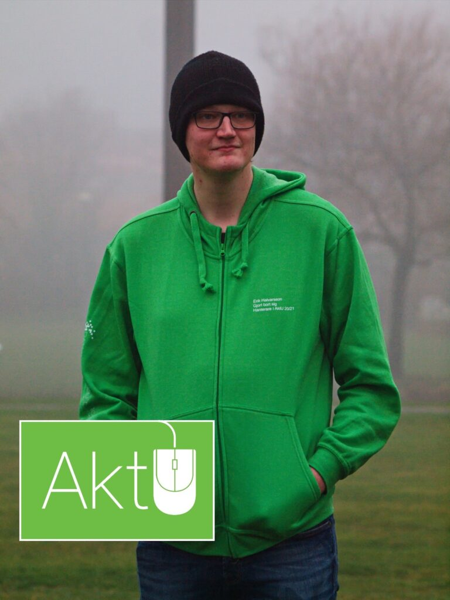

<figure>

<figcaption>

Foto: Johanna Tjernström

</figcaption>

</figure>

Vi lämnar nu D-Group och hoppar AKTIVT vidare till nästa utskotts intervjuer! Idag ska vi lära oss mer om kanske det mest aktiva utskottet på campus, Aktivitetsutskottet! Dagens intervjuer kommer att vara med utskottets ordförande (läs: Aktivitetshanterare) och utskottets kassör. Först ut är aktivitetshanteraren Erik Halvarsson!

Länkar för ansökan och nominering till samtliga poster hittas [här](https://d-sektionen.se/sok-fortroendeposter-vintermotet-2021/).

## Vem är du?

Mitt namn är Erik Halvarsson, och jag pluggar tredje året på mjukvaruteknik. Jag är 23 år gammal, och kommer från den lilla byn Ljusdal i Hälsingland. Min fritid går mycket till gaming, spela rollspel med polarna, läsa böcker eller kolla på serier.

## Berätta lite mer om posten som Aktivitetshanterare.

Posten utgår mycket på att vara ett stöd för alla delar av utskottet, vare sig det är D-LAN, AktU-gruppen, D-Band, eller helt nya grupper.  
Tillsammans med kassören utgör man även utskottets kommunikationslänk till kansliet och sektionsstyret, så det är bra att ha ett bra helhetsperspektiv på vad utskottet gör och vad de behöver för att kunna representera dem under kanslimöten.  
Det är det också hanterarens ansvar att ta förslag för aktiviteter från sektionsmedlemmar och hjälpa dem att göra det till en verklighet.

## Vad har varit roligast att göra som Aktivitetshanterare?

Svårt att säga, med omständigheterna har vi inte haft mycket möjlighet att göra så mycket. Men det roligaste har nog varit att snacka skit med grupperna och umgås, träffa nya personer. Det var också väldigt givande att få sitta på andra sidan under intervjuer.

## Behöver man ha några erfarenheter för att söka Aktivitetshanterare?

Jag skulle inte säga att några särskilda erfarenheter krävs, men det är bra att vara öppen för nya idéer och vilja lära sig. Det viktigaste är nog att vara taggad på att hjälpa sektionsmedlemmar att anordna aktiviteter.

## Vem ska söka Aktivitetshanterare? 

De som gillar att anordna aktiviteter och är intresserad av att hjälpa andra förverkliga sina idéer.

## Något mer att tillägga?

Jar Jar är en Sith Lord.
