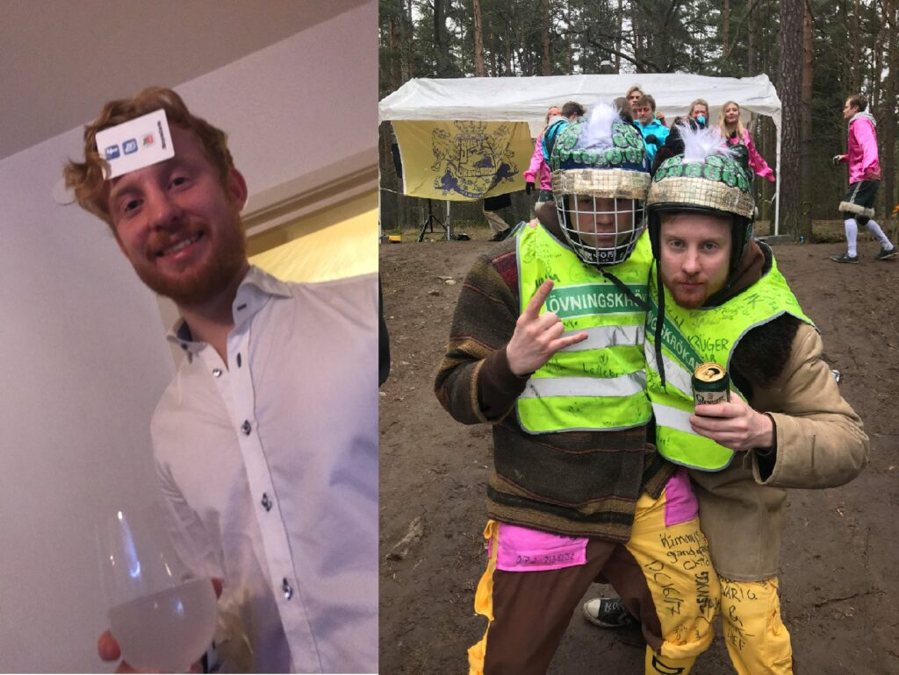

Vi hoppar nu vidare i intervjuserien till inga mindre än sektionens egna festeri, D-Group! Dagens intervjuer kommer att vara med dess ordförande (läs: Chief) och dess kassör. Är du taggad på att fixa ett riktigt fett DÖMD? Då bör du nog ta en bra titt på denna intervju, först ut är nämligen head honchon Max Mogren!

Länkar för ansökan och nominering till samtliga poster hittas [här](https://d-sektionen.se/sok-fortroendeposter-vintermotet-2021/).

## Vem är du?

Hej! Jag heter Max, är 22 år gammal och kommer ursprungligen från fina  
lilla Trosa. Utöver plugg och att planera DÖMD så har jag fått upp  
mitt intresse för matlagning och pröva på nya spännande recept. Extra  
bonus är att pröva på en ny typ av IPA till måltiden!

## Berätta lite mer om posten som D-Groups Chief.

Som Chief i D-Group förmedlar du information till och från gruppen  
till andra kommunikationskanaler. Till exempel sitter du i möten  
tillsammans med andra festeri-chefer och kårhus samt har du en stor  
inblick inom D-sektionen eftersom man sitter med i sektionens kansli.  
Du har även störst ansvar över att arbetet i gruppen går framåt.  
Alltså ska du försöka skapa så goda förutsättningar för gruppens  
arbete med tanke på välmående och genom att delegera arbetet jämnt  
mellan gruppen.

## Vad har varit roligast att göra som D-Groups Chief?

Till skillnad från andra poster inom D-Group sitter du i många möten  
tillsammans med andra sektioner eller personer, så man träffar alltså  
väldigt många nya människor både i arbetssammanhang med även om man vill planera in något roligt i kalendern!

Det har även varit oerhört roligt att se gruppen växa tillsammans och  
skapa vänner man kommer ha kvar resten av livet. Jag känner att jag  
även personligt utvecklats en hel del och lärt mig otroligt mycket.

## Behöver man ha några erfarenheter för att söka D-Groups Chief?

Innan jag sökte Chief hade jag inga erfarenheter av ledarskap. Det är  
nog dock gynnsamt att ha någon erfarenhet av grupparbete, likväl är  
det självklart även gynnsamt att ha erfarenhet av ledarskap! Det som  
jag skulle säga är det absolut viktigaste är att man har ett stort  
driv för att föra arbetet framåt och även empati för att kunna  
kommunicera med gruppen på bästa sätt.

## Vem ska söka D-Groups Chief?

Om du tror att du kan vara bekväm i rollen och sitter på någon av de  
egenskaper jag nämnde, och att du vill arra det absolut fetaste  
häftigaste mest otroliga DÖMD någonsin ska du självklart söka Chief!

## Något mer att tillägga?

Detta år har sett annorlunda ut från hur studentlivet vanligtvis är,  
och många av er (tänker framförallt på ni 1:or) har inte än fått  
uppleva Linköpings studentliv. Verksamhetsåret som ni kommer få ser ut  
att ha bra förutsättningar för ett riktigt bra studentliv, och det är  
ni tillsammans i D-Group som bidrar till det här. Våga söka och vara  
med att skapa det bästa studentlivet vi någonsin har sett!
