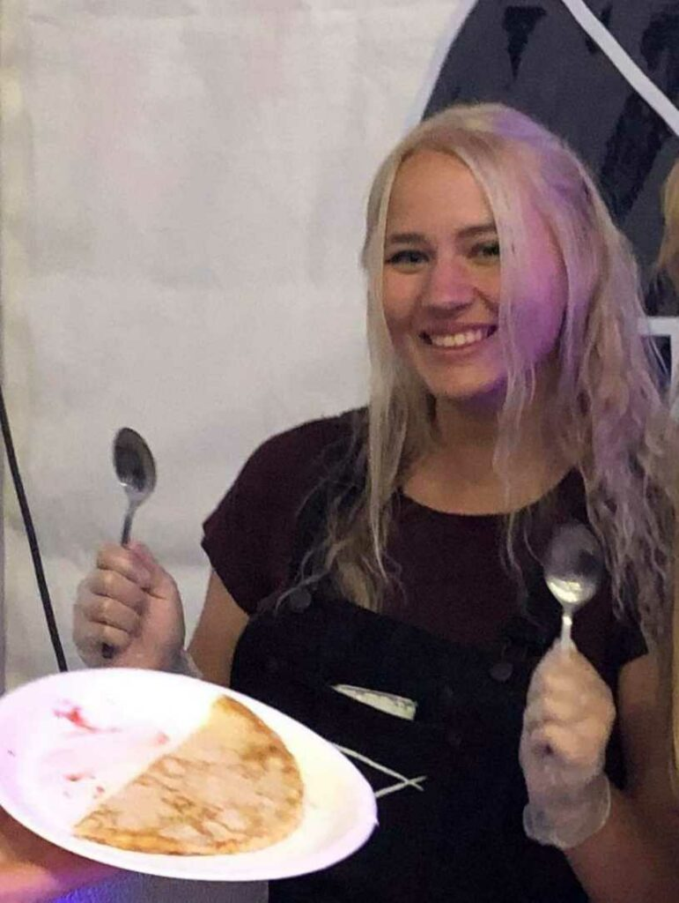

Halloj! Här kommer den andra halvan av dagens intervjuer! Medverkande i denna intervju är personen som har koll på Donnas stålar, nämligen Donnas kassör Jennifer Österman!

Länkar för ansökan och nominering till samtliga poster hittas [här](https://d-sektionen.se/sok-fortroendeposter-vintermotet-2021/).

## Vem är du?

Jag heter Jennifer Österman, är 20 år gammal från Åland, Finland och går D2!  
Jag är lite av en smygestet blandat med en smygekonom, så jag är ekonomiintresserad och gillar att måla, spela instrument, sjunga, osv. Förutom det spelar jag gärna diverse spel.

## Berätta lite mer om posten som Donnakassör.

Som donnakassör är man vice ordförande i Donna och får bolla idéer med primadonna. Till ens ansvar hör bokföring, budgetering, hålla reda på utlägg, samt skicka och betala fakturor. Som kassör i Donna är man även med i Kansliet och får se vad som händer där. Man får även välja ut damföreningen tillsammans med primadonna!

## Vad har varit roligast att göra som Donnakassör?

Det roligaste har ju varit att få planera event och att ha svinroligt med alla pinglor i donna!  
Ansvarsmässigt är det roligaste, för mig personligen, att hålla koll på fakturor och att bokföra.

## Behöver man ha några erfarenheter för att söka Donnakassör?

Absolut inte! Man ska bara vara villig att lära sig något nytt och inte vara rädd för att ställa frågor. Jag hade personligen inte några förkunskaper och det har inte gått någon nöd på mig.

## Vem ska söka Donnakassör? 

Du som är intresserad av posten! Är man strukturerad och intresserad så tycker jag det bara är att köra på!

## Något mer att tillägga?

Klart man ska söka Donnakassör! Kör!! Det blir kul!
