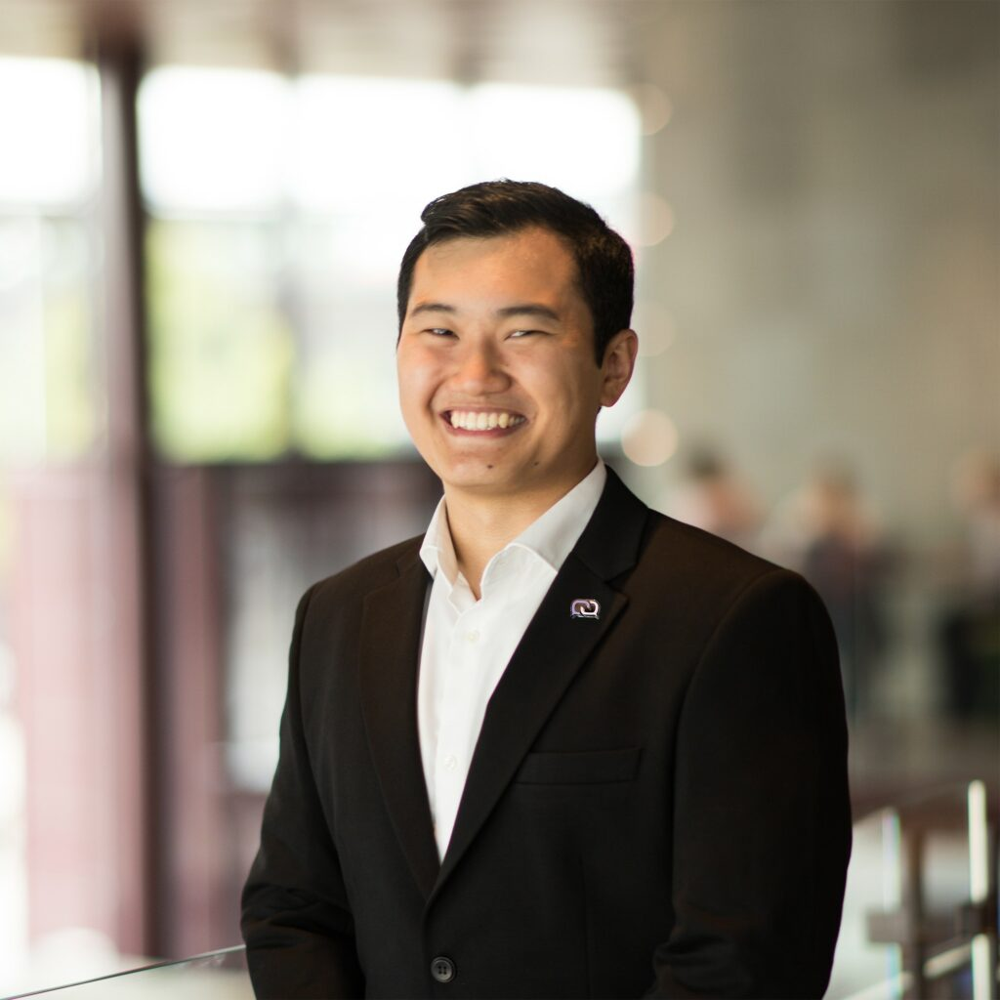

Ny dag, nya intervjuer med gamla förtroendevalda! Idag är det projektgruppen LINK:s tur, och dagens intervjuer är med inga mindre än dess projektledare och kassör/vice projektledare! Först ut är projektledaren Tobias Wang!

Länkar för ansökan och nominering till samtliga poster hittas [här](https://d-sektionen.se/sok-fortroendeposter-vintermotet-2021/).

## Vem är du?

Halloj!   
Tobias heter jag och är en 23-årig örebroare som är på mitt 4:e år i datateknik. Brinner för träning där innebandy ligger varmt om i hjärtat, aktier är nice och engagerar mig gärna i roliga projekt! Försöker lära mig mer om asianfood nu och att komma igång med att läsa en och annan bok.

## Berätta lite mer om posten som LINK projektledare.

I LINK är du tillsammans med en stor grupp studenter (årets gäng är på 28 starka studenter) där vi tillsammans genom ett av Sveriges största arbetsmarknadsdagar för IT&Data studenter.  

För mig innebär posten som projektledare att ge alla engagerade i LINK dem bästa förutsättningar för att alla i gruppen ska kunna uppnå sin fulla potential och nå sina mål med sitt engagemang! Till detta innebär det att se till att kommunikationen inom LINK fungerar bra och att det finns en sammanhängande planering. Konkreta rutinuppgifter som projektledaren har är att leda styrelsemötena i LINK, har kontakt med andra ordföranden inom D&Y sektionerna såväl runtom campus. Som projektledare kommer du även bemöta alla möjliga situationer som exempelvis allt från att hosta en stream, till att få ut saker från tullen till att hålla en och annan rökfest. 

## Vad har varit roligast att göra som LINK projektledare?

Definitivt gemenskapen med gruppen och att tillsammans få möjlighet att genomföra ett riktigt grymt projekt tillsammans! 

## Behöver man ha några erfarenheter för att söka LINK projektledare?

Oavsett vad för studentengagemasg som du skulle intressera dig - våga att söka! Du, precis som jag och alla andra här på campus är här för att utvecklas. Så det viktigaste du ska ha med dig när du engagerar dig är ett brinnande driv & intresse för uppdraget och du kommer lära dig mycket under resans väg! Våga att sök!

Istället för erfarenheter, vad förväntas om posten?  
Som projektledare kan du förvänta dig att ha många möten och att behöva ha många bollar i luften. Du kommer hamna i pressade situationer där du behöver ta beslut som påverkar många och du förväntas hjälpa till grupper med att underlätta kommunikation och planering. Slutligen bör du förvänta dig att posten i vissa perioder kommer att ta tid. 

## Vem ska söka LINK projektledare? 

Om du känner för en utmaning, vill träffa ett riktigt taggat och engagerad gäng och lära dig otroligt mycket så ska du definitivt kika på posten som Projektledare. 

## Något mer att tillägga?

Trots 2020 så har LINK varit riktigt kul och vi i årets gäng kommer se till att nästkommande år får goda grunder till att göra ett riktigt grymt LINK 2021.

Om du har några frågor/funderingar eller vill ha mer info om posten så hör gärna av dig! Du når mig genom Facebook alternativt [tobias.wang@linkdagarna.se](mailto:tobias.wang@linkdagarna.se)
