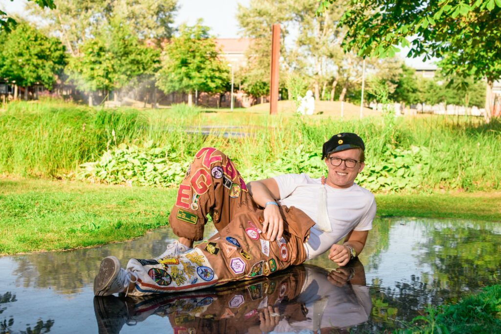

<figure>

<figcaption>

Foto: Cecilia Olsson

</figcaption>

</figure>

Hej sektionen!

I skrivande stund är det bara en dryg vecka tills ansökan till förtroendeposter 2021 stänger (17/1). Information om vilka poster som går att söka går att hitta [här](https://d-sektionen.se/sok-fortroendeposter-vintermotet-2021/).

För att alla sektionsmedlemmar ska få en tydligare inblick i vad varje post håller på med har en massa viktiga frågor skickats ut till de personer som sitter på posterna nu. Tvivla inte att söka om du tycker att en post verkar intressant, länkar för ansökan hittar du [här](https://d-sektionen.se/sok-fortroendeposter-vintermotet-2021/)!

Först ut i intervju-serien är ingen mindre än vår alldeles egna sektionsordförande Carl Magnus Bruhner!

* * *

## **Vem är du?**

Jag är en gammal civilekonom-avhoppare som efter några spännande år i arbetslivet bestämde mig för att söka lyckan på nytt med IT-programmet. Pluggar 4:e året nu med inriktning Säkra system, och extraknäcker som labass i nätverkskurser (TDTS06 & 11). Överengagerad är väl bara förnamnet, för fritiden består av sisådär 6 ideella uppdrag och lite annat skoj. Nyårsutmaningen är att löpträna alla 31 dagar i januari – lite kontrast mot den klassiska terminsstarten med TK och VSR då man inte bara dricker kranvatten precis.

## **Berätta lite mer om posten som Sektionsordförande.**

Posten sektionsordförande blir verkligen vad man gör den till! Min inställning är att man som ordförande är ytterst ansvarig för att skapa så goda förutsättningar som möjligt för allt engagemang i och för D-sektionen. Du leder också sektionsmöten och styrelsemöten, och är ansvarig utåt när det kommer till allt “seriöst” som att signa avtal och ibland vara den “tråkiga” (som t.ex. gällande Corona-restriktionerna nu) – men det är kul också, på sitt sätt!

Förutom att du blir tajt med ditt styre så har du också regelbundet möten med ordförandena på de andra tekfak-sektionerna, vilket gör att du får ett brett nätverk och nya vänner utanför sektionen!

## **Vad har varit roligast att göra som Sektionsordförande?**

Gemenskapen med mitt styre, och att få representera sektionen! Att leda sektionsmöten är jäkligt kul också, och jag håller tummarna för att vårmötet kan hållas fysiskt även om jag inser att det är optimistiskt.. Annars så var julstreamen riktigt kul, så man behöver inte hänga läpp bara för att saker och ting tvingas vara på distans! Dock tror jag att det blir ännu roligare när allt börjar återgå till det normala, inte minst att få träffa alla sektionsaktiva!

## **Behöver man ha några erfarenheter för att söka Sektionsordförande?**

Tidigare engagemang på sektionen är oerhört värdefullt, så att man förstår kulturen och vet hur allting fungerar. Ledarerfarenhet, och att känna sig trygg i att prata inför folk (du ska leda sektionsmöten!) är bra också, men i övrigt så tycker jag inte att man ska vara rädd för att söka! Jag tror att man lätt överskattar vad som krävs för att bli en bra sektionsordförande, så våga ta chansen!

## **Vem ska söka Sektionsordförande?**

Du som brinner för D-sektionen och vill bidra till att göra sektionen bättre eller minst lika bra i framtiden. Är det minsta sugen så borde du söka, och tagga några andra att söka till styrelsen också!

## **Något mer att tillägga?**

Förutsättningarna för leverera ett oerhört mycket bättre och roligare verksamhetsår 21/22 ser ut att vara väldigt goda, så missa inte den chansen! Jag ser fram emot att se till att ge min efterträdare en så bra start som möjligt! Tveka inte att maila mig ([ordforande@d-sektionen.se](mailto:ordforande@d-sektionen.se)) eller skriva till mig på Facebook om du har några frågor eller undrar något.
