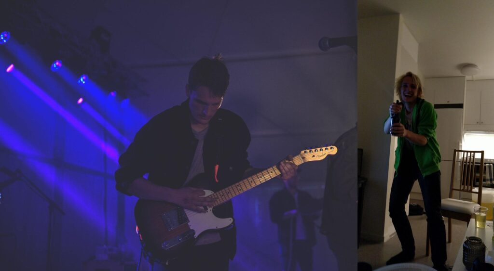

Vi rundar av helgen till ära med, ni gissade rätt, ytterligare en intervju! Dagens intervju är med en av sektionens ledamöter, nämligen Simon Jakobsson!

Om ni inte redan vet det så finns länkar för ansökan och nominering till samtliga poster [här](https://d-sektionen.se/sok-fortroendeposter-vintermotet-2021/).

## Vem är du?

Tjena! Mitt namn är Simon, 24 år ung (jämfört med majoriteten av styret) och uppvuxen i Malmö. Pluggar 3:e året på U programmet och varit aktiv i en drös olika saker genom mitt universitetsliv. På fritiden spelar jag mycket musik, där de äldre känner nog igen mig från kårallens scen där jag spela ofta i förra årets d-band.

## Berätta lite mer om posten som Ledamot.

Posten ledamot är lite av allt-i-allo posten i styrelsen. Jämfört med resten av styret har man inte riktigt något specifikt mål, utan man drar i egna projekt eller är en hjälpande hand till resten när de har mycket att göra.

## Vad har varit roligast att göra som Ledamot?

Roligast har nog varit att arrangera kickoff för kansliet samt julstreamen! Utöver detta så har gemenskapen med sektionsaktiva och styret varit roligt då jag tycker det är roligt att träffa nytt folk.

När man är ledamot har man inget specifikt mål vilket gör att man får arbeta med allt möjligt inom sektionen, vilket jag tycker har varit jättekul!

## Behöver man ha några erfarenheter för att söka Ledamot?

Tidigare engagemang inom sektionen kan vara bra att ha så man vet hur sektionen fungerar, men det är inte något krav. Även att haft en ledanderoll kan vara bra då man är väldigt självgående som ledamot.

## Vem ska söka Ledamot? 

Den som tycker det är tokroligt att engagera och förbättra sektionen i helhet tycker jag ska söka denna post!

## Något mer att tillägga?

Om du/ni har något projekt ni vill starta upp som angår sektionen men inte vet hur ni ska starta upp det får gärna höra av sig till mig på simon.jakobsson@d-sektionen.se eller skriv till mig på facebook!

P.S som gammal bandledare tipsar jag er som är grymma på musik att D-band har öppnat ansökan för 21/22, ta chansen för det är otroligt roligt att få spela inför 100-tals folk på kårallen (när de nu öppnar efter corona)! [https://www.facebook.com/dbandliu](https://www.facebook.com/dbandliu)
