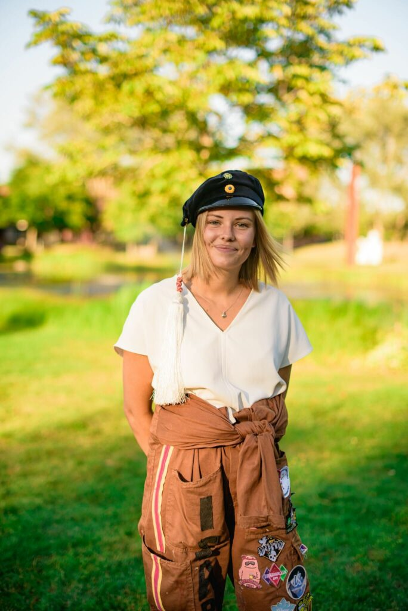

<figure>

<figcaption>

Foto: Cecilia Olsson

</figcaption>

</figure>

Vi har nu nått vår sista iteration av intervjuserien, bitterljuvt ju! Kvällens intervju är med Isabell Öknegård Enavall, som ser till att vår utbildning håller så hög kvalitet som möjligt!

Glöm inte bort att sista dagen för ansökan och nominering till samtliga poster är imorgon (17/1)! Länkar för ansökan och nominering finns [här](https://d-sektionen.se/sok-fortroendeposter-vintermotet-2021/).

Tvivla inte att söka om du känner dig taggad (eller nominera om du känner nån som du tycker passar bra för posten)!

## Vem är du?

Hej! Mitt namn är Isabell, är 23 år och läser nu mitt tredje år på IT. Alltså snart dags för kandidat vilket ska bli otroligt spännande och roligt.

## Berätta lite mer om posten som utbildningsutskottets ordförande.

Som utbildningsutskottets ordförande har man först och främst ansvar över utbildningsrelaterande frågor. Man leder möten och ser till så snordfarna gör det de ska inom deadline och diskuterar utbildningsfrågor tillsammans. Förutom detta så har man även kontakt med LinTek där man möter studenter i liknande positioner på andra program. Sist men inte minst så sitter man även med i styret.

## Vad har varit roligast att göra som utbildningsutskottets ordförande?

Det har varit otroligt lärorikt och roligt att leda en grupp men också att få inblick i hur utbildningarna ser ut inom de olika programmen vi har på sektionen, samt hur det fungerar på andra sektioner. Utöver detta har det även varit kul att ha inflytande och ha möjlighet att framföra studenternas åsikter och se att detta faktiskt gjort skillnad.

## Behöver man ha några erfarenheter för att söka utbildningsutskottets ordförande?

Jag hade lite erfarenhet från att leda grupper sedan innan men jag skulle absolut säga att detta inte är ett krav, sålänge du är noggrann och strukturerad. Detta är viktigt då det är mycket roliga möten och deadlines att hålla koll på så. Har du dessa egenskaper kommer det gå hur fint som helst!

## Vem ska söka utbildningsutskottets ordförande? 

Du som är intresserad och vill vara med och påverka utbildningsfrågor ska definitivt söka!

## Något mer att tillägga?

Puss och kram skumbanan
