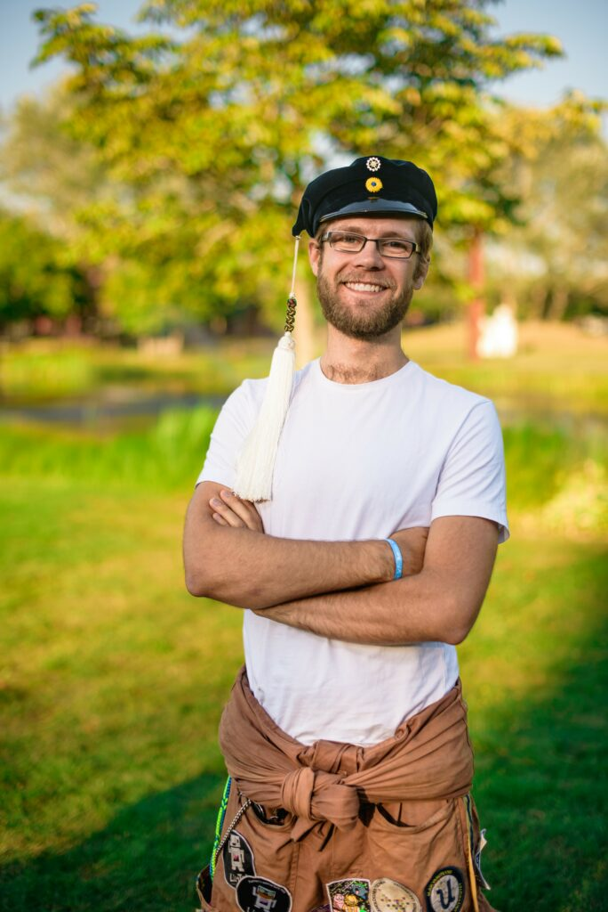

Vi inleder denna helg genom att iterera vidare till den 3:de intervjun! Temat är fortfarande poster inom styret och en viktig post där är vice ordförande, så vi låter Aleksi Evansson föra ordet!

Sök posten vice ordförande, eller någon annan av de poster som ska tillsättas under vintermötet [här](https://d-sektionen.se/sok-fortroendeposter-vintermotet-2021/).

## Vem är du?

Aleksi heter jag och tillhör väl kategorin gammal på sektionen men är åtminstone inte lika gammal som Mange! Jag pluggar U-programmet och fördelar fritiden på ett allmänt musikintresse, spex och klättring. Förutom styret detta år har jag engagerat mig på alla möjliga håll inom och utom sektionen tidigare, inget engagemang är det andra likt!

## Berätta lite mer om posten som Vice ordförande.

Ja, först är det lite som titeln antyder: agera stand-in för ordförande när det behövs, oftast på möten inom eller utom sektionen. Sedan specifikt för Vice är ansvaret för kansliet där man bl.a leder möten. Icke att förglömma är förstås den roligaste biten som delas med resten av styrelsen: styrelsearbete kring t.ex sektionsmöten och styrdokument!

Styrelsen blir ett tajt gäng och genom kansliet träffar du sektionens utskott och får både kontakter, vänner och insikt i sektionens alla delar!

## Vad har varit roligast att göra som Vice ordförande?

Att få lära känna övriga styret har verkligen varit det roligaste! Tittar man sedan på vad vi gjort så var Julstreamen himla kul att genomföra, något vi kanske aldrig hade kommit på om vi inte hade haft distansläge! Ett personligt nöje jag haft under året är att försöka leta rätt på en rimlig leverantör av bl.a profilkläder till sektionen som vi ska kunna samarbeta med över en lite längre tid och där får vi se om jag hinner lyckas innan sommaren kommer!

## Behöver man ha några erfarenheter för att söka Vice ordförande?

Behöver och behöver. Det är rätt hjälpsamt att ha lett ett utskott och kanske suttit i kansliet tidigare för att ha en bild av hur sektionen och kansliet fungerar. Det skadar inte heller att ha lite ledarerfarenhet då du ska leda kanslimöten och potentiellt också sektionsmöten om Sektionsordförande är upptagen eller sjuk!

## Vem ska söka Vice ordförande?

Alla! Är du taggad på engagemang och har lite koll på sektionen är det bara att söka, och kom ihåg att man kan lära sig på jobbet. Det blir ju ännu roligare att engagera sig om man dessutom får chans att utvecklas!

## Något mer att tillägga?

Dagens tips: är du lite osäker på om du fixar att vara med i styret? Dra med dig en kompis, sök varsin post och gör det ihop så känns det kanske lättare! Det fina med att det är fler som engagerar sig är att man kan ta stöd av varandra! Slutligen är det bara att höra av dig till mig om du har några frågor! ([vice@d-sektionen.se](mailto:vice@d-sektionen.se))
