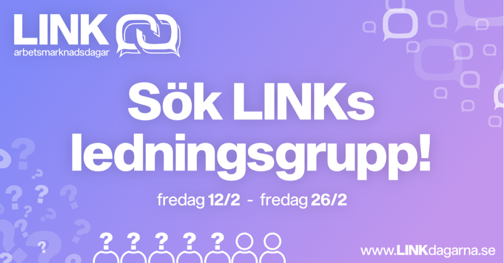

Planeringen för LINK 2021 har börjat men för att kunna komma framåt behöver vi er! Just nu rekryterar vi 5 personer som tillsammans med oss kommer bilda LINKs Ledningsgrupp 2021 och se till att nästa LINK blir oförglömligt.

De poster som söks är gruppansvariga till LINKs 5 undergrupper:

- Företag
- Mässa
- Event
- IT
- PR

Under våren kommer du sedan få ta ut din alldeles egna grupp som du sedan kommer att få agera ledare för. Det blir ditt jobb tillsammans med resterande i Ledningsgruppen att se till att alla vet hur dom kan bidra till att göra LINK 2021 till något speciellt. Vi söker dig som är fett taggad, engagerad samt har någon form av intresse för data och IT (du behöver alltså inte plugga D eller Y för att söka).

Taggad på att söka? Släng iväg din ansökan så tidigt som möjligt!  
Ansökningsperioden kommer att vara öppen från den 12/2 till 26/2 och ansökan sker här: [https://forms.gle/Gh7pnf8fzYXgwhUH9](https://forms.gle/Gh7pnf8fzYXgwhUH9?fbclid=IwAR3NKNYHYt9J5zgvqmJ6yfhV0g_W1I4BfDAU3K50pTKurx6_5tdk-4vlruE)

Du kan även nominera en eller flera personer som du tror skulle passa till LINKs Ledningsgrupp, nomineringar sker här:  
[https://forms.gle/niUYp1X3DNL3HZiA8](https://l.facebook.com/l.php?u=https%3A%2F%2Fforms.gle%2FniUYp1X3DNL3HZiA8%3Ffbclid%3DIwAR09yoPsuATxWl6TOlye-438Vqy3LzhtG5H1quAKklN9nlisl6aSltTFUb8&h=AT3oIkcvnaNM_n04C9xVD52Dvy6pxgsDHQEfF2DCQNhpWMFJTu03h2Sig_CFeA7hm-Jdo-v6p43JbF1xiEh2vma6ZDtrkwy4UvRiRADp9y5V7Ubd6fDGTQ3tCYgDo5jIkDL4&__tn__=q&c[0]=AT1k2aTB8-TS08EX8VR8DPgYRf2cPNYaftmHYK3PEFBQ416zHUE-ulIUoDHfBlyh4zouWLsWYTIMXgzpUyQ0hkfo6rjs3-_HSKR19t0x2TWWE2z5T5IIhifEbpnfTrziPllTTsRbuSKz9px7tX3KJtG_)

  
Har du postspecifika frågor kan du kontakta sittande på posten, se postbeskrivningar för kontaktuppgifter. För andra frågor eller funderingar kan du självklart kontakta projektledare för LINK 2021, Sophie Ryrberg på [sophie.ryrberg@linkdagarna.se](mailto:sophie.ryrberg@linkdagarna.se) eller kassör/vice projektledare Emily Fredriksson på [emily.fredriksson@linkdagarna.se](mailto:emily.fredriksson@linkdagarna.se)

**POSTBESKRIVNINGAR:**  
\-Gruppansvarig IT  
Som Gruppansvarig IT kommer du vara ansvarig för IT-gruppen som är mellan 3-5 personer. IT-Gruppen ansvarar för alla IT-system, både externa och interna för LINK 2021.Som Gruppansvarig för IT-gruppen bör du framförallt vara driven, bekväm med att arbeta i team och intresserad av problemlösning. Utöver detta är det bra att du har erfarenhet eller kunskap av följande:  
\*Versionshantering och projektledningsverktyg som t ex Trello, Git etc.  
\*Linux CLI och automatisering med Cron-jobs.  
\*Webbutveckling, gärna med någon av följande språk/verktyg: Wordpress, PHP, Javascript, HTML, CSS.  
\*SQL-databaser och databashanterare.  
\*Enhets- och integrationstester.  
Har du frågor om posten som Gruppansvarig IT, kontakta sittande Gruppansvarig Thomas Näslund på [thomas.naslund@linkdagarna.se](mailto:thomas.naslund@linkdagarna.se)

\- Gruppansvarig PR  
Som Gruppansvarig PR kommer du vara ansvarig för PR-gruppen. PR-gruppen ansvarar för att all image, kommunikation och marknadsföring av LINK 2021 sköts på ett professionellt och attraktivt sätt, gärna även med ett sinne för innovation. Detta innefattar allt ifrån design av planscher och profilkläder. I denna grupp finns det två stycken Art Directors samt två PR-ansvariga. Din uppgift som Gruppansvarig kommer vara att koordinera deras arbete och tillsammans med din grupp handha image, stil, kommunikation utåt samt enlighet i LINK. Som Gruppansvarig PR kommer du också ha all kontakt med leverantörer av marknadsföringsmaterial.  
Gillar du ha många bollar i luften, full av kreativa och nytänkande idéer? I så fall ska du söka Gruppansvarig PR!!  
Har du frågor om posten som Gruppansvarig PR, kontakta sittande Gruppansvarig Armin Ehrenwall på [pr@linkdagarna.se](mailto:pr@linkdagarna.se)

\- Gruppansvarig Mässa  
Som Gruppansvarig Mässa kommer du vara ansvarig för mässgruppen. Mässgruppen är dem som är huvudansvariga för själva mässdagen. Här ingår en mängd olika uppdrag som exempelvis ritande av mässkartan, logistik och personalansvar kring mässan och banketten efter mässan. Som ansvarig kommer ditt huvudansvar vara planering och att strukturera upp gruppens arbete. Mässgruppen kommer bestå av dig, logistik-, personal-, service-, kontaktsamtals samt bankettansvarig. Vi söker dig som är strukturerad, har ett sinne för logistik och har ett öga för helheten såväl detaljerna.  
Har du frågor om posten som Gruppansvarig Mässa, kontakta Sophie eller Emily!

\- Gruppansvarig Företag  
Som Gruppansvarig Företag kommer du vara ansvarig för företagsgruppen. Företagsgruppen sköter all kontakt med företag som vill delta i LINK och samarbetspartners. Du kommer även ha god kontakt med eventgruppen för att koordinera de event som sker under LINK-dagarna samt mässdagen.  
Som gruppansvarig för företagsgruppen söker vi dig som är bekväm att leda en grupp, en som brinner för service och vill driva LINK till nya höjder med intressanta och aktuella företag/samarbetspartners!  
För postspecifika frågor, kontakta sittande Gruppansvarig Företag Erik Matti på [erik.matti@linkdagarna.se](mailto:erik.matti@linkdagarna.se)

\- Gruppansvarig Event:  
Som Gruppansvarig Event kommer du vara ansvarig för eventgruppen. Eventgruppen planerar och styr upp alla event under LINK-dagarna. Som gruppansvarig för eventgruppen har du huvudansvaret över gruppen och sköter den översiktliga planeringen. Du kommer även ha god kontakt med företagsgruppen för att koordinera företagsevent.  
Vi söker dig som är kreativ, idérik och vill skapa nya och spännande upplevelser! The sky's the limit!  
För postspecifika frågor, kontakta sittande Gruppansvarig Event Eric Dahlgren på [eric.dahlgren@linkdagarna.se](mailto:eric.dahlgren@linkdagarna.se)

Hittat en eller flera poster som verkar intressant? Tveka inte och SÖK!

//Emily och Sophie
