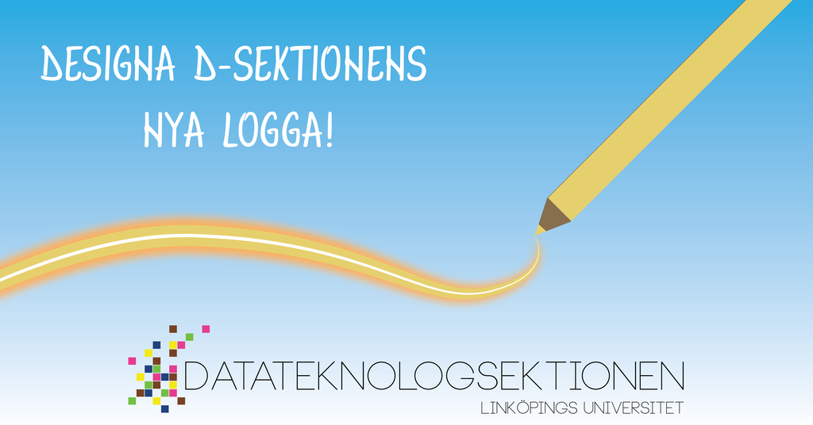
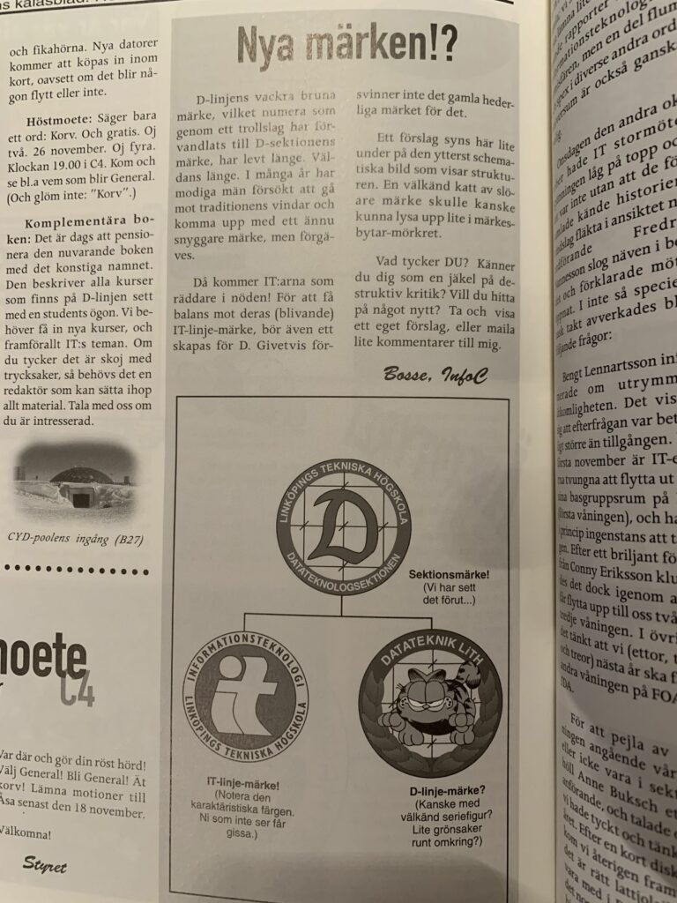
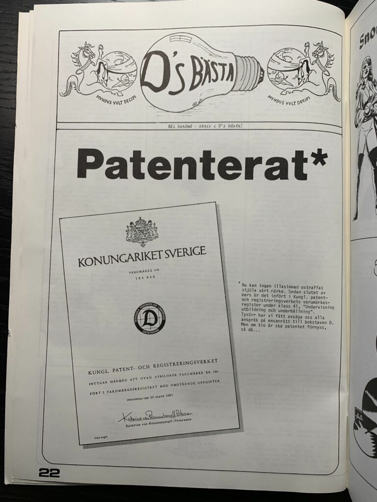
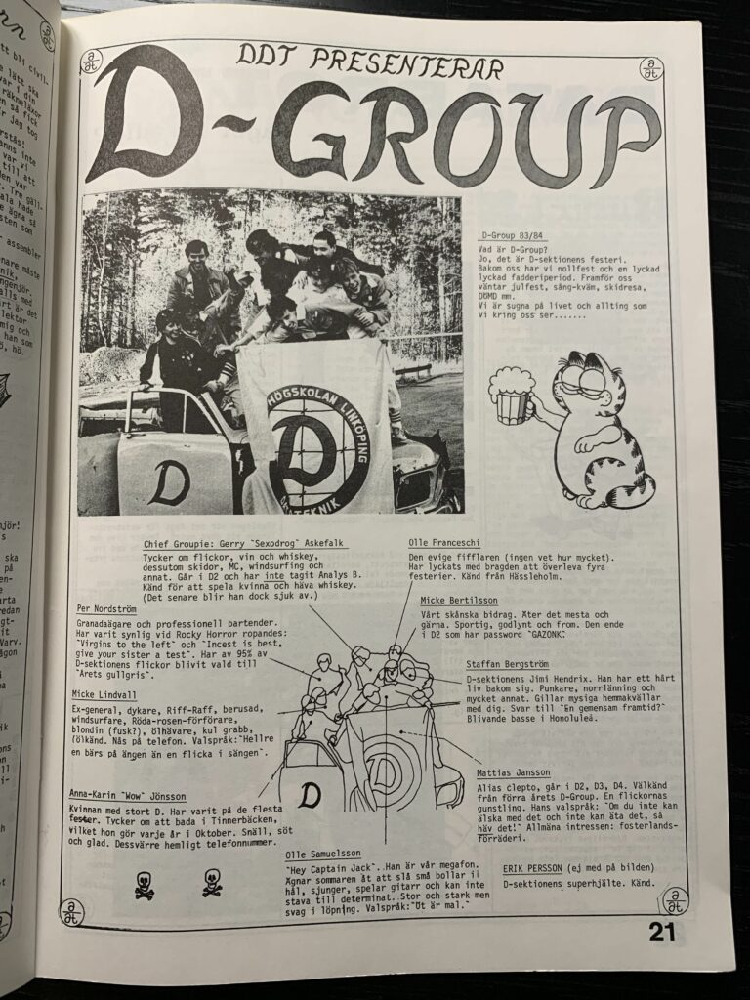
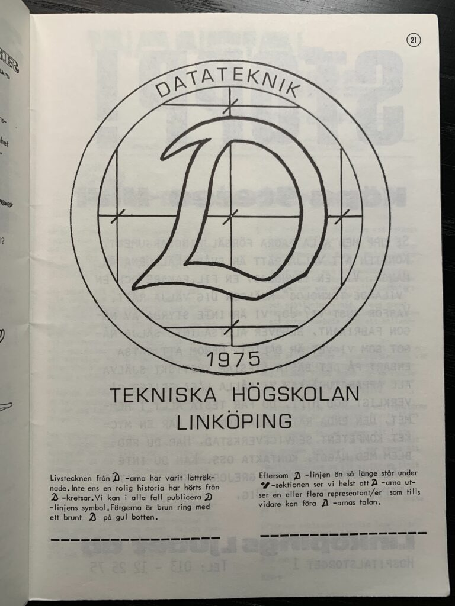

Vår nuvarande logga har representerat D-sektionen i snart 10 år och den har både varit igenkänd som en unik symbol bland övriga sektioner, men också en frustration när det vankas målning i Märkesbacken eller tryck. Vi i styret har därför som avsikt att ta fram en ny logotyp med mer traditionell stil och vill att ni ska hjälpa till!

Vi vill att ni ska designa ett förslag på den nya loggan, som helt eller delvis kommer användas av AD för inspiration till en färdig version. Vi vill att loggan ska representera hela D-sektionen, vid sidan av programsymbolerna. När ni designar loggan är det bra att ha i åtanke att den ska vara stilren och kommer att användas till Märkesbacken, tryck, digitalt o.s.v. Ha även i åtanke hur övriga sektioners symboler på tekfak ser ut!

Tävlingen avslutas **28:e februari** och därefter kommer styret i samråd med AD att välja ut/ta fram ett förslag på logga som kommer att beslutas om på vårmötet. Utöver äran kommer vi även att erbjuda priser till dem vars förslag vinner.

Vi i styret har bifogat förr**™-**bilder på sektionsloggan ni kan ta som inspiration för erat verk! Det kan mycket väl vara så att det är vårt original vi ska gå tillbaka till, men kanske med en modern twist eller andra sätt att representeras i olika medier.  

- 
    
- 
    
- 
    
- 
    

Vi har en kravlista på hur loggan ska vara konstruerad:

1. Loggan måste vara rund
2. Loggan ska ha anknytning till den ursprungliga D-loggan
3. Färgerna som ingår bör följa sektionens färger (se grafisk profil)

Ni som tävlar får använda vilka medel som helst för att skapa loggan. Exempel på medel kan vara i form av ritningar, Illustrator, vektorgrafik o.s.v. Det är viktigt att AD kan återskapa bilden om den skickas in som pappersform.

Den färdiga loggan ska skickas till [simon.jakobsson@d-sektionen.se](mailto:simon.jakobsson@d-sektionen.se) senast den 28:e februari. Ni är välkomna att höra av er löpande för att diskutera era idéer!

För information angående den grafiska profilen hänvisar vi till:

[https://d-sektionen.se/grafisk-profil/](https://d-sektionen.se/grafisk-profil/)

Lycka till!

Mvh

D-styret och AD
