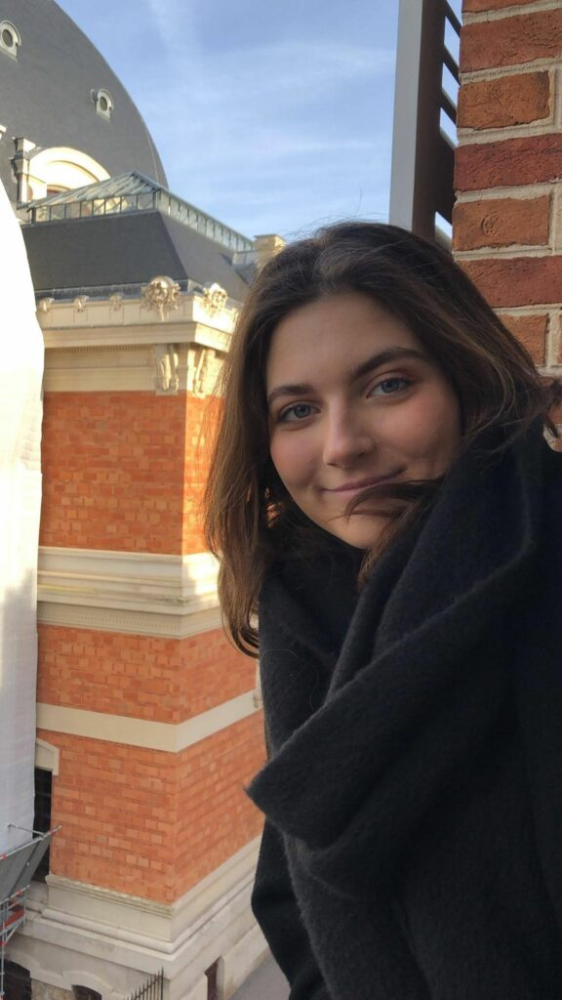

Vi klämmer in en till intervju innan dagen är slut, nu är det dags för Alumniutskottets ordförande Cajsa Wargren att berätta lite om sin post!

Sök posten ordförande i Alumniutskottet, eller någon annan av de poster som ska tillsättas under vårmötet [här](https://d-sektionen.se/sok-fortroendeposter-varmotet-2021/).

* * *

## **Vem är du?**

Namn : Cajsa Wargren

Program : D

Intressen : Kollar mycket film och serier, gillar även att gå promenader och lyssna på dokumentärer. Just nu har jag fastnat för Minecraft igen och spelar det, eller The Legend of Zelda, efter plugget.

## **Berätta lite mer om posten som Alumniutskottets** **ordförande.**

Huvudansvaret är att vara kontakten mellan tidigare studenter och de som nu studerar på d-sektionen. Du ska arrangera event där studenter får en bättre bild av arbetslivet som kommer, samt engagera alumner till att fortsätta vara med och bidra för studenternas framtid.

Vad dessa event kan vara är både lunchföreläsningar, sittningar och pubar. Mitt år har såklart påverkats av CoVid-19 och möjligheterna har varit begränsade, men med lite kreativitet och viljestyrka så går det anordna event ändå! Man har inte bara möten med sektionen och sitt utskott men även mellan andra sektioners alumniordföranden och LinTek vilket kan ge idéer och inspirera till nya saker att genomföra.

## **Vad har varit roligast att göra som Alumniutskottets** **ordförande?**

Det har varit väldigt roligt och givande att få ha kontakt med alumner samt prata och höra om deras arbetslivserfarenheter. Tyvärr har det varit lite begränsat men tror verkligen att detta är enormt kul i vanliga fall och som alumniansvarig kan man få höra lite historier från alumnerna som de inte alltid säger på sina lunchföreläsningar 

Men om jag ska vara helt ärlig så har jag just detta år uppskattat något enormt att få gå på möten och se och höra från andra människor på sektionen! Utan detta engagemang hade jag inte lärt känna de människor som jag nu känner och min vardag hade varit mycket tråkigare i coronatider.

## **Behöver man ha några erfarenheter för att söka Alumniutskottets** **ordförande?**

Nej det kan jag inte säga, jag själv går första året och jag har ändå lyckats vara alumniansvarig. Såklart att det kan underlätta att ha en inblick i sektionen och hur utskott funkar, jag hade lite med mig från gymnasiet där jag engagerade mig inom elevkåren men så värst mycket visste jag inte när jag började. Jag tror att den som vill kan lära sig och jag tror att detta är ett jättebra sätt att få en större inblick inom sektionen och få se hur kul och givande det kan vara att engagera sig.

## **Vem ska söka Alumniutskottets** **ordförande?**

Någon som tycker det är kul att lyssna på gamla studenter om sin tid på LiU och vad de arbetar med nu. Samt någon som skulle vilja se mer av hur sektionen arbetar och vad man kan göra för de som studerar på d-sektionen.

## **Något mer att tillägga?**

Om du funderar på att söka så tveka inte, sök! Du kommer inte ångra dig, det är en givande erfarenhet och kom ihåg att det är vi studenter som är d-sektionen!
