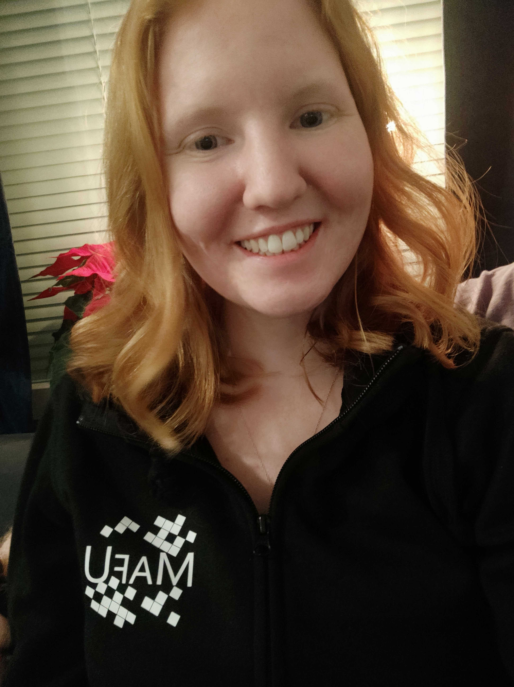

Vi går vidare i intervjuserie-loopen, och hoppar till nästa iteration! I kvällens iteration så medverkar Malin Widén, som är ordförande i Marknadsföringsutskottet!

Sök posten ordförande i Marknadsföringsutskottet, eller någon annan av de poster som ska tillsättas under vårmötet [här](https://d-sektionen.se/sok-fortroendeposter-varmotet-2021/).

* * *

## **Vem är du?**

Malin heter jag och läser U3. Jag är en glad rödhårig östgöte uppväxt i bodesamhället Mantorp.

## **Berätta lite mer om posten som Marknadsföringsutskottets ordförande.**

Posten innebär att man leder arbetet i MafU genom att man planerar och leder utkottets möten, går på möten med TFK (tekniska fakultetens kansli) och andra sektioners MafU ordföranden samt representerar MafU i kansliet. I början av året får man även välja ut sitt utskott genom att hålla i intervjuer.

## **Vad har varit roligast att göra som Marknadsföringsutskottets ordförande?**

Det roligaste har varit att hänga med mitt utskott och lära känna dem ännu mer. Det var även roligt att få vara på andra sidan av en rekryteringsprocess.

## **Behöver man ha några erfarenheter för att söka Marknadsföringsutskottets ordförande?**

Jag skulle inte säga att några erfarenheter behövs med det är en stor fördel om man inte är rädd att prata inför folk eftersom du kommer leda möten och gå på en hel del möten.

## **Vem ska söka Marknadsföringsutskottets ordförande?**

Alla såklart!! Arbetet i MafU är superroligt! Vill du att sektionen ska leva vidare en lång tid framåt (vilket du såklart vill!) så ska du söka MafA så potentiella nya studenter kommer till just vår fina sektion!

## **Något mer att tillägga?**

Glöm inte att hemmissionera! Än är det absolut inte för sent!! Och sök MafA såklart!

Har du frågor om posten är det bara att skicka till mig på FB eller till [malin.widen@d-sektionen.se](mailto:malin.widen@d-sektionen.se)
