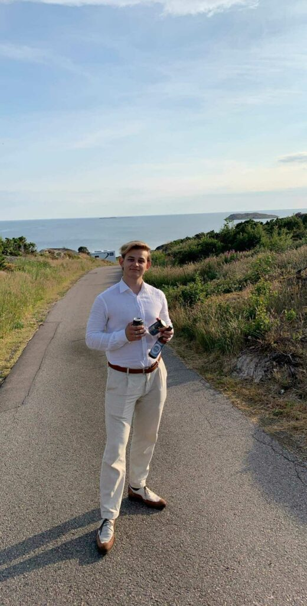
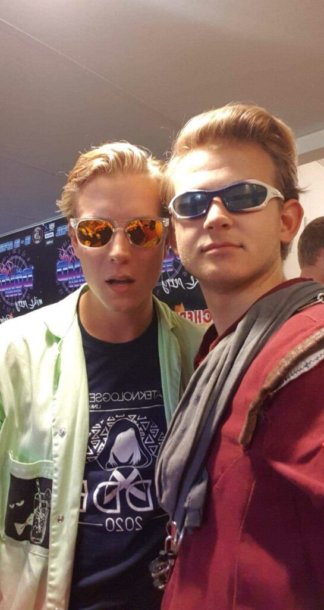

- 
    
- 
    

Kvällens intervju är en limited-edition sådan! Det är nämligen så att Otto Heino, som är Studienämndsordförande för IT-programmet, även representerar sektionens övriga Studienämndsordförande i denna intervju! Man kan alltså säga att det fem intervjuer i en, en sällsynt syn alltså!

Sök posten Studienämndordförande för D/IT/IP/U/Master, eller någon annan av de poster som ska tillsättas under vårmötet [här](https://d-sektionen.se/sok-fortroendeposter-varmotet-2021/).

* * *

## **Vem är du?**

Mitt namn är Otto Heino och går i IT3, jag är en grabb på 21 år som älskar styrketräning och skidåkning. Jag brinner även starkt för vårt kära studentliv.

## **Berätta lite mer om posten som **Studienämndsordförande**.**

Som Studienämndsordförande för man talan för studenterna i sitt program gentemot universitetet. Detta görs genom att få fram klassutvärderingar tillsammans med klassreparna, dessa presenteras sedan för examinatorerna. Man sitter även med i möten med de ansvariga för programmet samt med de ansvariga för alla data- och medieprogram. Man lyfter även mer akuta problem med kurser som att till exempel få till en extrainsatt tenta med en ny examinator.

## **Vad har varit roligast att göra som Studienämndsordförande?**

Att sitta på möten med examinatorer och prata med dem om kurser och sitt programs framtid. Det är även utmanande och kul att framföra studenternas åsikter på ett sätt som är mottagligt för examinatorerna och tillsammans komma fram till de bästa lösningarna. Men det bästa är att känna att man gör konkret skillnad för programmet.

## **Behöver man ha några erfarenheter för att söka Studienämndsordförande?**

Att gå några år in på programmet så man har en större helhetsbild samt att ha en god mötesvana kan vara fördelaktigt. Men detta är absolut inget som är nödvändigt!

## **Vem ska söka Studienämndsordförande?**

En person som bryr sig om studenterna och programmets utveckling. Någon som är driven, lösningsorienterad och intresserad för att få en djupare inblick i sitt program.

## **Något mer att tillägga?**

Va en god student och kursutvärdera!
