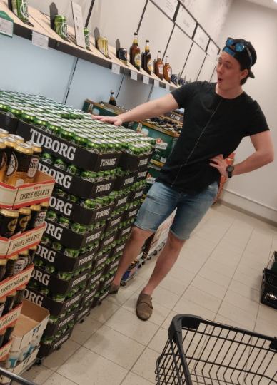

Precis som slutet av denna ansökningsperiod snart närmar sig så närmar sig även slutet av denna intervjuserie, bitterljuvt ju! Vi går hur som helst vidare med stormsteg till dagens första intervju, vilken är med Valberedningens ordförande Filip Jakobsson!

Sök posten ordförande i Valberedningen, eller någon annan av de poster som ska tillsättas under vårmötet [här](https://d-sektionen.se/sok-fortroendeposter-varmotet-2021/).

* * *

## **Vem är du?**

Jag heter Filip, pluggar U3 och kommer från den norraste delen av Sverige, Gävle. Mina intressen är att dricka kaffe, öl och drinkar, ibland alla samtidigt. Om ni inte hittar mig bakom bardisken så sitter jag nog säkert på Biltema där folk tittar snett på mig för jag jag beställde in 4 korv med bröd med extra salt på.

## **Berätta lite mer om posten som **Valberedningens ordförande**.**

Som valberedningens ordförande har du hand om rekrytering av resterande ledamöter i Valberedningen. Sedan är du ytterst ansvarig för valberedningens arbete och sköter även kommunikationen utåt med kansliet och kandidater.

Valberedningens uppgift är att ta ut lämpliga kandidater till de olika förtroendeposterna, så som styrelseposterna på sektionen samt utskottsordföranden och kassörer.

## **Vad har varit roligast att göra som Valberedningens ordförande?**

Definitivt att få jobba och ha kul med resterande av valberedningen. I valberedningen så jobbar man oftast tillsammans och har mycket diskussioner. Vilket leder till att gruppen blir tajt och det är ju dunderskoj.

## **Behöver man ha några erfarenheter för att söka Valberedningens ordförande?**

Nej, jag anser att egenskaper väger tyngre än erfarenheter. Valberedningens ordförande bör ha ett intresse för sektionen då man måste sätta sig in i vad som krävs av varje förtroendevald post. Som ordförande kan det även vara bra att ha de så kallade standardegenskaperna för ledare som bland annat strukturerad och kommunikativ.

## **Vem ska söka Valberedningens ordförande?**

Någon som vill jobba med och leda en tajt grupp, lära sig mer om sektionen och bli en mästare på intervjuer.

## **Något mer att tillägga?**

Bli förtroendevalda, superkul och extremt lärorikt!

Tveka inte att höra av er om ni har några funderingar.
