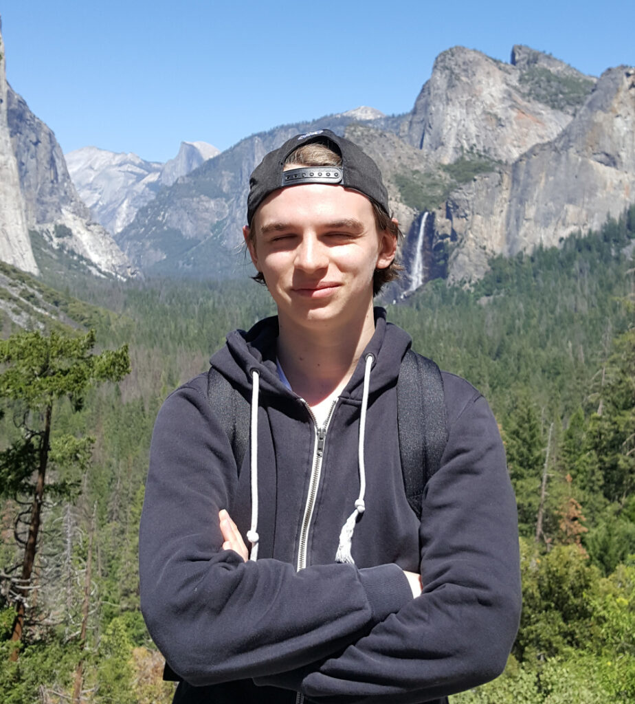

Vi hoppar vidare till nästa intervju! Nu ska vi höra lite från personen vars utskott bl.a. ser till vår kära sektionshemsida har så fräsiga funktioner som möjligt, nämligen Webmastern Max Skanvik!

Sök posten Webmaster, eller någon annan av de poster som ska tillsättas under vårmötet [här](https://d-sektionen.se/sok-fortroendeposter-varmotet-2021/).

* * *

## **Vem är du?**

Jag heter Max, är 22 år och pluggar andra året på datateknik. Är riktigt intresserad av och tycker om programmering, datorer, ny teknik, att lära mig nya saker och att engagera mig i studentlivet! Spenderar mycket av min fritid på YouTube och roliga serier.

## **Berätta lite mer om posten som Webmaster.**

Som Webmaster leder man Webbgruppens arbete och tar initiativ till att utveckla nya saker. Man sköter kommunikationen mellan gruppen och styrelsen och utvecklar deras önskemål.

## **Vad har varit roligast att göra som **Webmaster**?**

Det roligaste har varit att lära sig så mycket nytt och hur Webbgruppens olika projekts och deras kodbaser fungerar och att vidareutveckla nya funktionaliteter till dem. Även att få ta ansvar för och leda arbetet för en grupp som sysslar med programmering, och att få lära känna en grupp personer med liknande intressen, och att lära känna andra sektionsaktiva.

## **Behöver man ha några erfarenheter för att söka **Webmaster**?**

Nej. Däremot är det en stor fördel om man har möjlighet att lära sig om hur våra viktigaste projekt och de teknologier de är byggda i fungerar, främst medlemssidan som är byggt i React och backenden till den som är byggd i Django, innan hösten. Då har man koll på hur saker och ting fungerar och behöver inte lägga lika mycket tid på att lära sig nytt under höstterminen samtidigt som Webbgruppen har kodstugor.

## **Vad innebär en kodstuga?**

En kodstuga innebär att Webbgruppen träffas och kodar tillsammans (på Zoom under vårt verksamhetsår). Det brukar gå till så att jag som ordförande har en genomgång och stämmer av hur folk ligger till i olika projekt vi utvecklar, och därefter kodar vi. Utöver att koda så vägleder och hjälper jag resten av gruppen med deras arbete. Våra kodstugor är 3 timmar långa och vi har dem en gång varje vecka.

## **Vem ska söka **Webmaster**?**

Om man gillar programmering och vill lära sig nya teknologier, vill få kunskaper inom webbutveckling med moderna ramverk, vill pröva på att leda en grupp, vill ta ansvar eller vill hjälpa andra med programmering så är rollen som Webmaster en utmärkt möjlighet!

## **Något mer att tillägga?**

Jag kommer att lära dig det viktigaste av det jag lärt mig under mitt verksamhetsår. Du får när du vill under ditt år fråga mig om du behöver hjälp att förstå något, så ska jag göra mitt bästa för att hjälpa dig. Om du vill så får du gärna vara med på våra kodstugor under resten av vårterminen så du får se hur det kan gå till och kanske lära dig lite.

  
Har du frågor om rollen som Webmaster eller Webbgruppen får du mer än gärna höra av dig till mig på [webmaster@d-sektionen.se](mailto:webmaster@d-sektionen.se)
