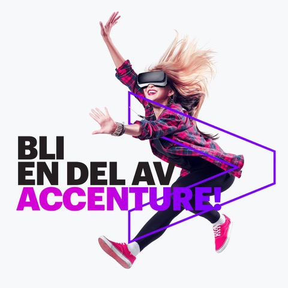

Funderar du på vad du vill göra efter examen, eller kanske till sommaren? Vilka företag är intressanta, vilka tekniker vill jag arbeta med, vilka tjänster finns det ens!? Passa på och lyssna på Accentures lunchföreläsning, där du får en insyn i hur det är att arbeta som konsult på Accenture.  
  
Under måndagen den femte Mars kommer Kim & Linnea, båda konsulter på Accenture, hålla en spännande föreläsning om hur deras arbetsdagar ser ut. Kim arbetar som Google could consultant och kommer djupdyka i tekniker som Cloud & Data infrastruktur, samt AI & Marknadsföring. Linnea arbetar som konsult för SAP, och arbetar med kravställning och implementation av verksamhetskritiska affärssystem. Efter föreläsningen kommer ni ha full koll på hur konsultlivet på Accenture ser ut, och vilka möjligheter som finns för studenter.  
  
Hos Accenture löser vi våra kunders hårdaste utmaningar genom att erbjuda svårslagna tjänster inom: Strategy, Consulting, Digital, Technology och Operations. Vi samarbetar bland annat med mer än tre fjärdedelar av Fortune Global 500 (500 största företagen i USA), driver innovation för att förbättra hur världen fungerar och lever. Med kompetens inom mer än 40 branscher och alla affärsfunktioner levererar vi innovativa resultat för en krävande, ny digital värld.  
  
Datum:  
5:e Mars  
  
Anmälan dig på länken [här](https://docs.google.com/forms/d/e/1FAIpQLSd3HdCC9946PD4kRqcNzs7Ka7P5-mZhr4cuvO_zcdQx7SZGcg/viewform?fbclid=IwAR0URKNgmKEb950hiSL7rZCwATqt36W4bDoLAD0Y8BNtnRrRAEu2ezK0Dkw) (stänger 12.00 4:e Mars).
