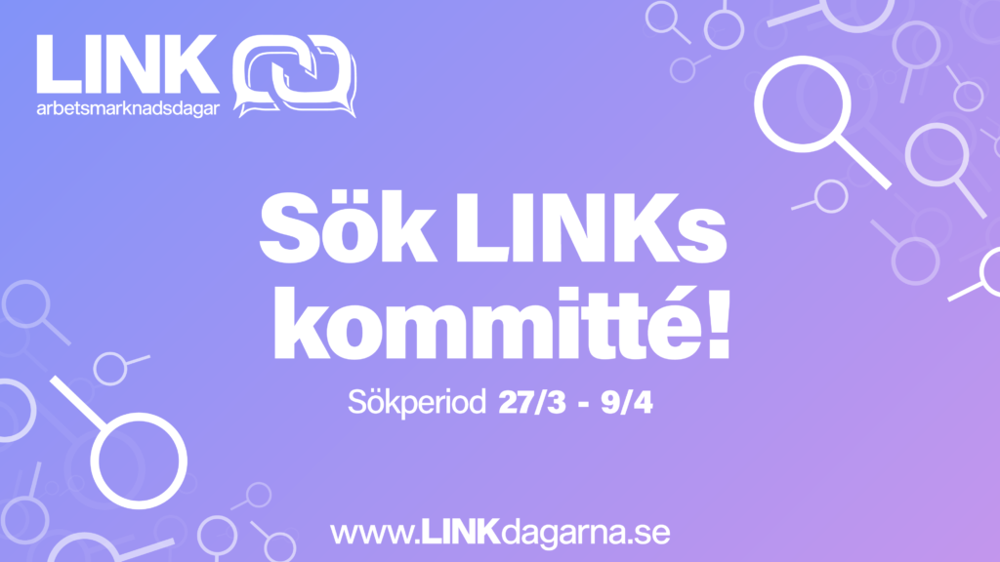

Nu har äntligen ansökan till årets LINK kommitté öppnat! Vill du vara delaktig i en av Sveriges största mässor inom data och IT? Ta chansen och sök eller nominera någon till LINK 2021!   
I kommittén för LINK får du inte bara ett väldigt roligt år där du lär känna en massa nya människor från olika program, men även erfarenhet och utveckling studierna ofta inte kan ge. Kombinationen närheten till företag och planering som ger fysiska resultat skapar en snygg merit till ditt CV!  
Vi söker till grupperna:

- Eventgruppen
- Företagsgruppen 
- IT-gruppen 
- Marknadsföringsgruppen
- Mässgruppen

Ansökningsformulär: [https://forms.gle/vg9UraXEY42vEbrr6](https://forms.gle/vg9UraXEY42vEbrr6)  
Nomineringsformulär:  [https://forms.gle/HeVDVMZYCpCkrTCz6](https://forms.gle/HeVDVMZYCpCkrTCz6)  
Ansökan är öppen till fredag 9/4 och intervjuer sker löpande, så tveka inte på att söka direkt!   
Läs mer om de olika grupperna och även se presentationer av de gruppansvariga på facebookeventet: [https://www.facebook.com/events/740200506692660](https://www.facebook.com/events/740200506692660)
