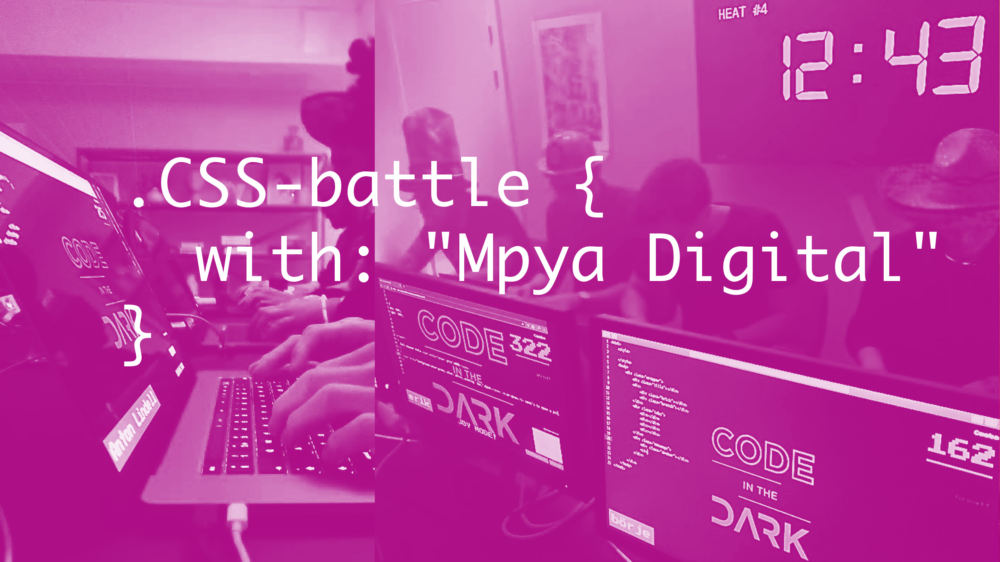

**CSS-battle** **with** **Mpya** **Digital** 

**What can you expect?** 

Explore your creative self together with a friend or two in this exciting after-school event with Mpya Digital. In a coding battle against your other peers you will make creations that would make even Bob Ross himself impressed. 

Prepare for a fun night with problem solving together in groups. Ask an Mpyan for clues and take the chance to mingle and talk with the Mpyans while solving the problem.

**What you need:** Your computer, headphones, and a problem-solving mindset. 

**What about food then?** Before the event you will receive a voucher from Foodora! Please enter your name, email address and telephone number in the registration. _A pro tip is to order the food before so that you don’t get distracted while solving the problem!_

**Who are** **Mpya** **Digital?**  

Mpya Digital is an IT consulting company that started in January 2018. We believe that our job should be fun, challenging and developing, which we summarize as Work is joy! Today, the company consists of three core functions, consultants, sales and recruitment and we have grown to 55 good hearted colleagues! 

As consultants, we of course focus on good delivery in web and software development for our customers in more or less all industries, ie we work with all types of tech related companies. We also want to contribute with a holistic perspective, how we act as role models for each other and the importance of authenticity. 

We have a culture with a focus on activities, educations and climate that contributes to becoming confident consultants and can thus perform at a high level. 

We love to spend time together (when it is not a pandemic we use to hang out at the office) and do fun things. For example, we play boardgames, solves problems like the one we are going to do now, and more!  

Read more about us at: [https://mpyadigital.com/](https://mpyadigital.com/) 

Are you curious about what is going on in our minds? Read our articles here: [https://mpyadigital.medium.com/](https://mpyadigital.medium.com/) 

Want to see updates about what is happening at Mpya more daily? Follow us on [https://www.linkedin.com/company/mpya-digital](https://www.linkedin.com/company/mpya-digital) 

**Date:** 27/4-2021

**Start time:** See you all at 18.00!

**Register here:** [https://forms.gle/iFUxhyKg17jYZtz5A](https://forms.gle/iFUxhyKg17jYZtz5A)
