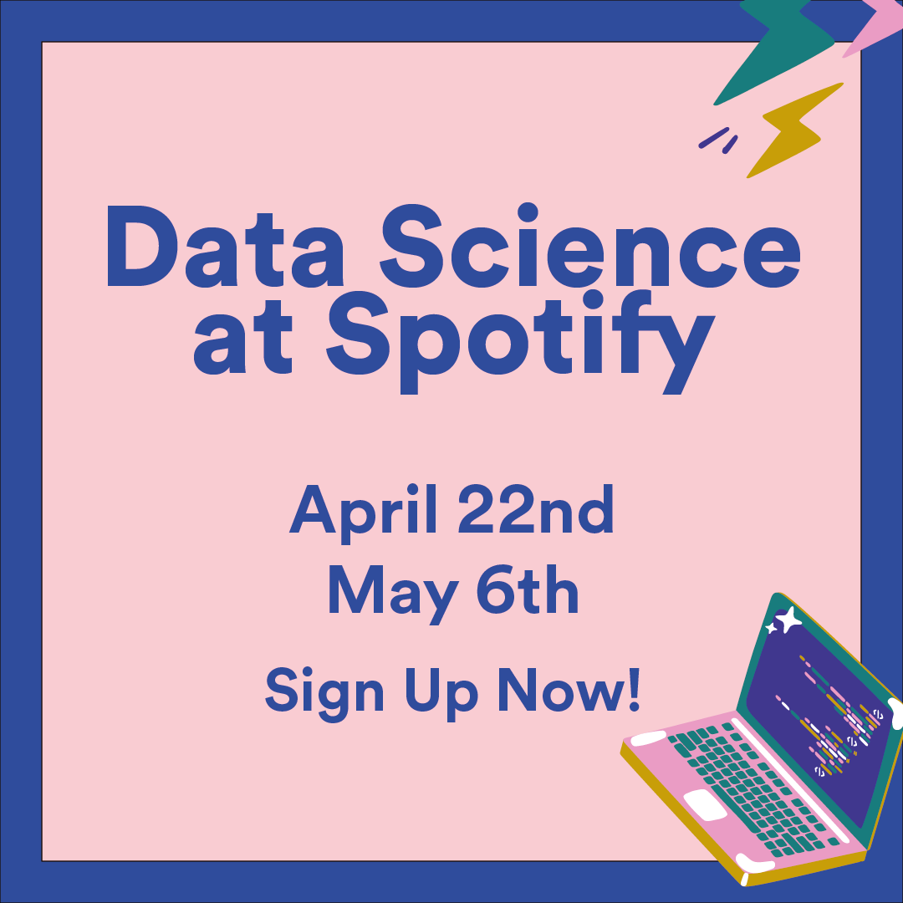

What does it really take to evolve an app like Spotify? What do all of the talented people at the (home)offices all over the world spend their time on? Well, the answer to both those questions is to a quite large extent; Data Science. Now, Data Science is quite an all-encompassing term that does not really describe anything. With this in mind, we want to give you a glimpse into what it means at Spotify. So, If you have ever had an interest in what data Science at Spotify might entail these are the events for you!

On Thursday the 22nd of April Neville Li, Claire McGinty, Sahith Nallapareddy, & Joel Östlund will present: "Spotify Optimized the Largest Dataflow Job Ever for Wrapped 2020". [Sign up here!](https://datascienceatspotifywrapped.splashthat.com/)  
  
Following that, on Thursday the 6th of May Mårten Schultzberg will present: "Spotify’s New Experimentation Coordination Strategy".  
[Sign up here!](https://datascienceatspotifybuckets.splashthat.com/)
