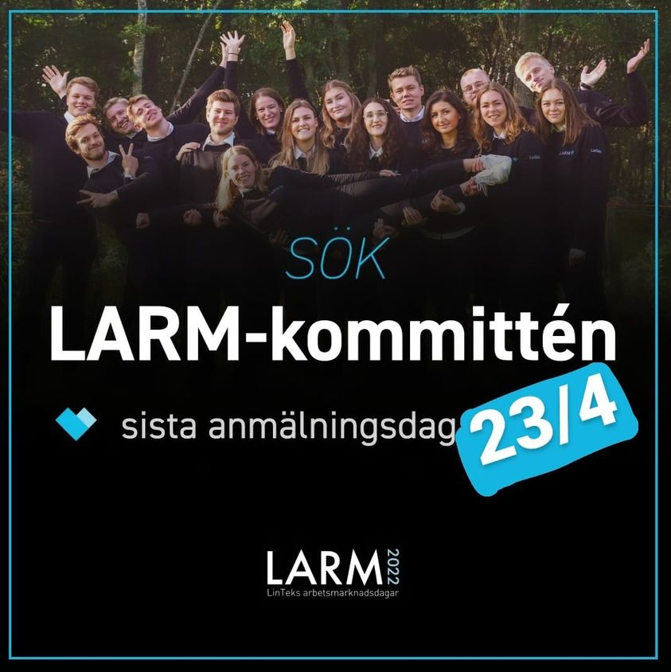

Här kommer ett meddelande från LARM, som söker folk till sin kommitté!

* * *

Vill du ha någonting extra att se fram emot i höst? Ta möjligheten att söka till LARM-kommittén 2022! Ansökan stänger på fredag 23/4.

Som en del av LARM-kommittén är du med från start och genomför ett av campus största projekt. Ett oförglömligt år med möjligheten att knyta kontakter både med studenter från andra utbildningar men också med företagsrepresentanter. Det blir en höst full med aktiviteter, nya möten och en möjlighet att bidra med någonting positivt till alla studenter vid Linköpings Tekniska Fakulteten.

Du får även stor möjlighet att påverka ditt eget arbete både individuellt och i grupp. Under året står en rad teambuilding aktiviteter och andra roligheter på schemat, så bered dig på ett spännande år!

Läs mer om de olika posterna och ansök på [https://larm.lintek.liu.se/apply](https://larm.lintek.liu.se/apply) innan den 23/4.
