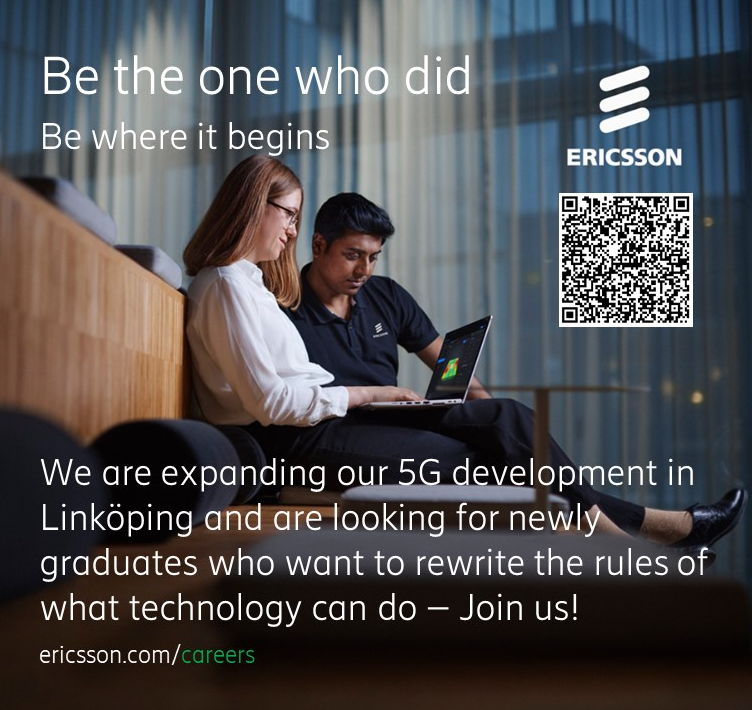

**A MESSAGE TO ALL D, IT, U AND IP STUDENTS DOING THEIR LAST YEAR AT LIU!**

**Looking for an exciting job with global perspectives? Want to be where it begins?**

Ericsson in Linköping is right now recruiting to meet the exploding demands on 5G. We are looking for newly graduated software designers/developers, system developers and test engineers who want to join us and be the ones who did!

**_Check out these ads and find your favorite:_**  [Ericsson Careers Linköping](https://jobs.ericsson.com/search/?createNewAlert=false&q=&locationsearch=link%C3%B6ping&optionsFacetsDD_customfield1=)

Did we catch your eye? Don’t miss the details below…

**Ericsson R&D Center in Linköping**

Ericsson R&D in Linköping is at the forefront of 5G development and we use many new technology concepts, e.g. Cloud implementation and Artificial Intelligence.

We have a very flexible work setup, which makes it possible for us all to share our time in a structured way between the Ericsson office and the home office.

**How do we do it?**

At Ericsson we work in teams where we have different competences and experiences. This means that the team members are part of developing new features in the mobile networks from ideas to deployment in customer networks. 

Working with cutting edge technology is both exciting and challenging. As a developer in one of our teams you have, together with the other members, full responsibility for analysis, design, implementation, and test of the code you produce – all the way to customer delivery. Which specific tasks you do is decided in the team and is based on what you bring to the table in form of skills and interests.

**What is a 5G network?**

An Ericsson 5G network is an open platform made for innovation. It's designed to cater for all the use-cases and use-places that can be realized with a faster, more responsive, and more reliable connectivity. And that brings new experiences to smartphones and other devices. The number of cellular IOT devices has already surpassed 1 billion and is estimated to surpass 5 billion in 2025. Many of these devices will support services that we used to see as futuristic, such as AR, VR, connected automated vehicles and remotely controlled robots. 

Our 5G networks are currently breaking new ground all over the world, with commercial networks live across 5 continents. The development of our 5G system is now expanding into new environments, e.g. Cloud native.

**So…what to do now?**

1. Deep dive into these exciting job offerings: [Ericsson Careers Linköping](https://jobs.ericsson.com/search/?createNewAlert=false&q=&locationsearch=link%C3%B6ping&optionsFacetsDD_customfield1=)
2. Choose your favorites.
3. Send in your applications.

You won’t regret it!!
