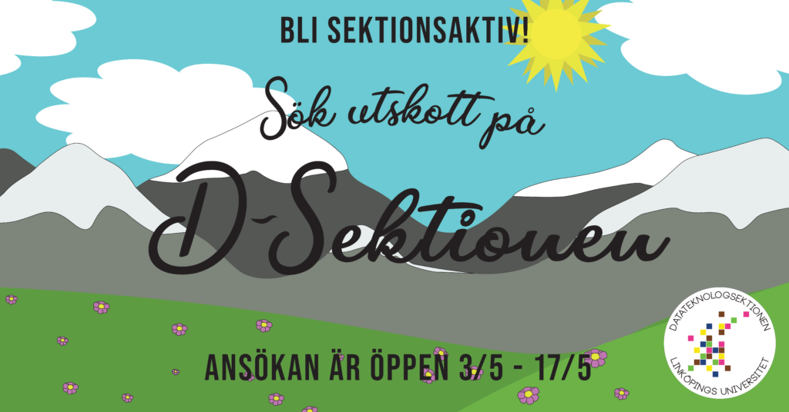

Missa inte att söka till de utskott som just nu söker medlemmar för verksamhetsåret 21/22! Allt roligt och (viktigt) sektionen gör kan bara hända eftersom sådana som du blir sektionsaktiva, så ta chansen att få bidra till sektionen! Om du undrar något om utskotten så finns en kortare beskrivning längre ner!

Söka kan du göra här: [https://forms.gle/twtqTRxuWgyMh63Q9](https://forms.gle/twtqTRxuWgyMh63Q9). Anmälan är öppen fram till och med den 17 maj!

De utskott som just nu söker är:

- Aktivitetsutskottet (AktU)
- Ekonomiutskottet (DEG)
- Marknadsföringsutskottet (MafU)
- Näringslivsutskottet (NärU)
- Webbutskottet (WebbU)
- Werkmästeriet (Werk)
- Infoutskottet (Info)

Om du har några frågor om rekryteringen eller övrigt så kan du kontakta tillträdande vice ordförande Richard Johansson ([richard.johansson@d-sektionen.se](mailto:richard.johansson@d-sektionen.se)).

### Infoutskottet (Info)

Hej! Det är så att infoutskottet inte har någon ordförande än. I början är tanken (om ingen ordförande hittas) att någon i styrelsen kommer delegera uppgifter till utskottet, utan ordförande. Det är alltså möjlighet att söka vanlig post i utskottet. Om ni är intresserade att söka Info ordf. så går även det att göra!

Infoutskottet arbetar med sektionens alla kanaler, våra sidor i litanian, sektionsfotografering och mycket mer. Så känner du att du är en fena (eller vill bli en fena) på att instagramma, skriva texter till tidningen, utföra intervjuer eller fotografera så tycker vi att du borde söka!

Om ni har frågor så kan ni kontakta tillträdande vice ordförande Richard Johansson ([richard.johansson@d-sektionen.se](mailto:richard.johansson@d-sektionen.se)).

### Aktivitetsutskottet (AktU)

Aktivitetsutskottet ansvarar för att det alltid finns roliga och engagerande event för sektionens medlemmar att gå på utanför studietiden.   
Aktivitetsgruppen håller i allt från fotboll- och innebandykvällar till brädspel- och rollspelskvällar, med en sittning eller två inkastad här och var.  

Gruppen D-LAN arrangerar varje år det väldigt uppskattade eventet D-LAN, som 2020 var Sveriges största LAN (RIP Dreamhack)!Med senaste reglementeändringen har vi nu mycket mer frihet i hur vi lägger till grupper till utskottet, och vi söker just nu gruppledare för det gröna AktU och det blåa D-LAN. 

Har ni frågor, funderingar, eller idéer på nya grupper ni vill skapa och leda under Aktivitetsutskottet så kan ni kontakta ordförande på [aktivitetshanterare@d-sektionen.se](mailto:aktivitetshanterare@d-sektionen.se)

### Ekonomiutskottet (DEG)

DEG är sektionens sprillans nya ekonomiska utskott. Som medlem i DEG kommer du hjälpa sektionskassören med bokföring och bugetuppföljning. Som medlem i DEG får du en unik inblick i sektionens ekonomi och hur sektionen fungerar i sin helhet, tveka inte och sök!

Har du några funderingar kan du kontakta Sektionskassör 21/22 [michelle.krejci@d-sektionen.se](mailto:michelle.krejci@d-sektionen.se)

### Marknadsföringsutskottet (MafU)

Marknadsföringsutskottet jobbar med marknadsföring av D-Sektionen! Utskottet har till huvuduppgift att göra reklam för sektionens utbildningar mot gymnasieelever och locka ännu fler att göra samma utmärkta val som alla dagens medlemmar redan har gjort: Läsa D, IP, IT eller U på LiTH. Detta görs i form av hemmissionering, mässor, sociala medier och D-Tour!

D-Tour är MafUs “flaggskepp” där vi bjuder in gymnasieelever och visar dem hur det är att studera på D-Sektionen samt hur studentlivet är! Såklart så blir det sittning för att verkligen visa hur studentlivet är och få eleverna taggade på att söka till just D-Sektionen!

Men! D-Tour behöver däremot en projektgrupp vilket är det jag söker just nu. Posterna som krävs till detta är en kassör, projektledare samt en boende och logistikansvarig! Känner du att marknadsföra är din grej? Eller vill du vara med att planera ett event? Sök till MafU idag!

Om du har några frågor så tveka inte att höra av dig till Marknadsföringutskottets ordförande 21/22 på [henrik.rehn@d-sektionen.se](mailto:henrik.rehn@d-sektionen.se)

### Näringslivsutskottet (NärU)

NärU är D-Sektionens näringslivsutskott. NärUs uppgift är att sköta kontakten och samarbetet mellan sektionen och näringslivet. Detta innebär att vi håller kontakten med företag och anordnar evenemang tillsammans med dem såsom företagskvällar, lunchföreläsningar och annonsering.

Planen nu under våren för NärU är att fylla två poster, marknadsföringsansvarig och miljöansvarig.

Som marknadsföringsansvarig har man ansvaret att sköta kommunikation från utskottets sida ut till studenterna. Detta innebär att ansvara för NärUs Facebook, information som behövs till infoutskottens mail och all annan form av marknadsföring från utskottets sida.

Som Miljöansvarig har man ansvar för att hålla en god arbetsmiljö i utskottet. Det innebär att jobba tillsammans med NärA för att se till att det hålls god sammanhållning inom utskottet. Miljöansvarig ansvarar även för att planera och genomföra interna aktiviteter.

Har du några frågor kan du höra av dig till NärA 21/22 via [john.enblom@d-sektionen.se](mailto:john.enblom@d-sektionen.se)

### Webbutskottet (WebbU)

Webbutskottet är ansvarig för funktionaliteten på sektionens hemsida och dess tjänster. Förutom att se till att nuvarande system är i drift arbetar gruppen också med utveckling av ny funktionalitet som ämnar gagna medlemmarna och sektionens verksamhet i stort.

Planen är att rekrytera halva Webbutskottet innan sommaren och resterande efter för att försöka få in lite nya studenter i utskottet.

Om du har några frågor eller funderingar kan du kontakta Webmaster 21/22 på [isak.horvath@d-sektionen.se](mailto:isak.horvath@d-sektionen.se)

### Werkmästeriet (Werk)

Werkmästeriet är de som tar hand om sektionens invetarier och lokaler. Det är vi som ser till att det finns kaffe att brygga i Netlight, att Configura inte fylls av pärmar och att Kianu Revs (bilen) rullar.

Innan sommaren är förhoppningen att kunna tillsätta två poster, VägWerk och KraftWerk.

VägWerk är den som ansvarar för att bilen fortsätter rulla, ger den lite kärlek när den behöver och allmänt skäller ut folk som lämnar den i sämre skick än den var innan.

KraftWerk tar hand om sektionens förråd och invetarier, ser till att struktur finns i förråden och att de regler som finns efterföljs. Man har också lite ansvar för att det som finns i förråden är inveterat, så att man vet vad sektionen har tillgång till.

Finns det några funderingar kan du kontakta Intendent (HufvudWerk) 21/22 [dag.jonsson@d-sektionen.se](mailto:dag.jonsson@d-sektionen.se)

Sök D-sektionens enda Mästeri! Det blir kul!
