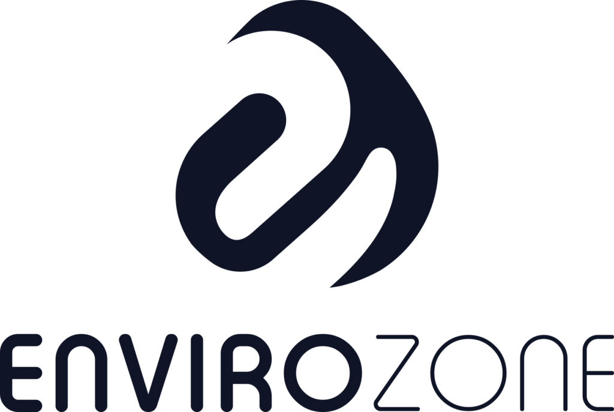

Envirozone söker nu programmerare till kunduppdrag.

Önskad profil: Kunskap att programmera i C, gärna med erfarenhet av inbyggda system och mekatronik samt förståelse för applikation/funktion.

För mer information kontakta affärsområdeschef Thomas Larsson / 070-511 89 88.
