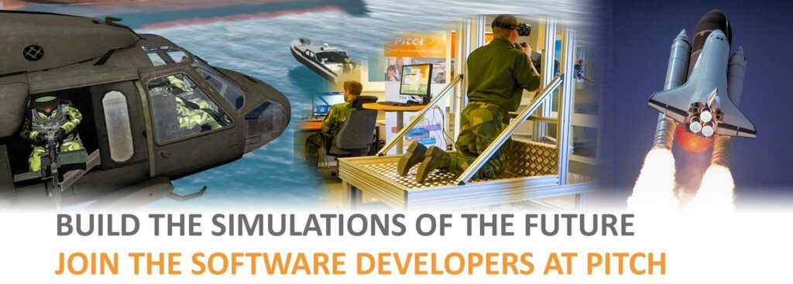

Sveriges mest spännande exjobb och jobb finns på Pitch!  
Inom världens mest avancerade high-tech organisationer, som t.ex. NASA, Boeing, Mitsubishi och BAE Systems, bygger man idag framtidens simulatorer. Plattformen för detta är världsunik och kommer från vårt team i Linköping. Vi levererar banbrytande teknik till mer än 300 företag inom rymd, flyg, försvar, tillverkning, järnväg och andra branscher. Vi erbjuder nu både exjobb och jobb och vi vill därför bjuda in till en studentkväll den 12:e oktober kl 18:00. Vårt kontor ligger centralt i Linköping ovanför Systembolaget på Lilla Torget (Repslagaregatan 25).  
Kom och lyssna på hur vi jobbar, vad vi kan erbjuda och ta en titt på vår arbetsplats. Efter presentationen bjuder vi på pizza och tilltugg.

Det finns begränsat antal platser så se till att säkra din plats!  
När? Tisdag 12 oktober, klockan 18.00  
Var? Repslagaregatan 25  
Anmälan hittar du [här](https://forms.gle/geucCMdXwoKwqeBi6).  
Anmälan stänger 10 oktober eller då samtliga platser fyllts.
