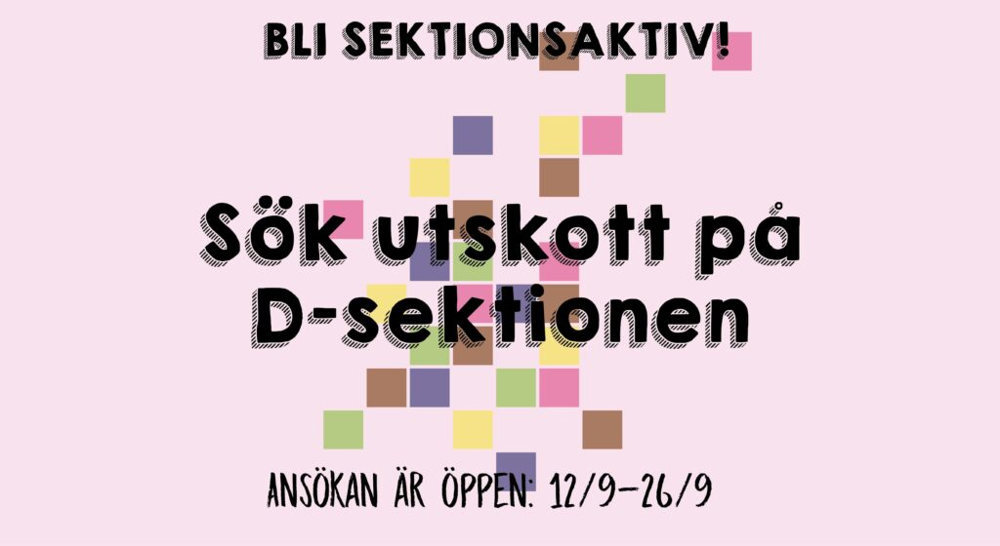

Vill du vara med och bidra till sektionen, träffa massor av nya människor och samtidigt ha väldigt kul? Då har du kommit helt rätt! På denna sida samlar vi information om alla rekryterande utskott samt länkar till ansökan.

Om du lyckas komma med i något av dessa utskott blir du sektionsaktiv. Detta innebär att du, förutom att bidra till vår verksamhet, får vara med på tre väldigt roliga evenemang under året som endast är för oss ca. 150 studenter som är sektionsaktiva.

Ansökningsperioden pågår den 12-26 september kl 23:59.

Vill du istället nominera någon till ett utskott får du gärna skicka iväg ett mail till utskottets ordförande med en motivering samt relevanta kontaktuppgifter till personen du nominerar.

<!--more-->

## Aktivitetsutskottet

Aktivitetsutskottet består av flera grupper som anordnar diverse aktiviteter och ämnar se till att det alltid finns någonting kul att göra tillsammans med andra på sektionen. Utskottets två huvudsakliga grupper är aktivitetsgruppen **AktU** (med fina gröna tröjor) och **D-LAN**, som båda nu söker nya medlemmar.

### **AktU**

AktU håller i en mängd olika aktiviteter för sektionen, allt möjligt från sport till sittningar. Tidigare år har AktU anordnat saker som laserdome, retrospel- och brädspelskvällar samt fotboll och innebandy. Utöver det har vi också anordnat aktiviteter så som Guitar Hero/Singstar på \[hg\] och sittningar som arrangerats tillsammans med utskott på andra sektioner.

Vad AktU kommer göra under året är väldigt fritt och det finns mycket utrymme till att starta något nytt, vilket är det som är så roligt med just AktU! Vill du vara med och anordna ett brett utbud av evenemang eller förverkliga just din idé på vad som vore kul att göra? Då borde du söka till AktU!

AktU söker:

- PR & Tryck x2
- Fotbollsansvarig
- Innebandyansvarig
- Mat & snacks
- Brädspelsansvarig
- Allt-i-allo x2

[Sök till AktU](https://docs.google.com/forms/d/e/1FAIpQLSfSFil67k7UG7TKn5hAeLoZpqae5MRT07lef4-EpvORgxvt4A/viewform?usp=sf_link)

**Fredrik Martinsson  
[fredrik.martinsson@d-sektionen.se](mailto:fredrik.martinsson@d-sektionen.se)**

### **D-LAN**

Årets största LAN-händelse behöver även i år ett drivet projektteam! D-LAN är ett 3-dagars LAN som årligen anordnas av D-sektionen, öppet för alla studenter. Såklart kommer 2022’s upplaga av D-LAN dessutom att bli större och bättre än någonsin tidigare. I början av vårterminen kommer D-LAN maxa med datorplatser och stora turneringar i flera e-sportstitlar. Detta är något man inte vill missa!

D-LAN söker:

- **Personalwerk (Mia Minardi)** \- Posten Personalwerk innebär att man ansvarar för all personal som kommer arbeta under LANet. Detta innebär bland annat rekrytering av personal, jobbavtal, jobbutbyten och schemaläggning. Dessutom innebär posten ett delat ansvar för allt werkande, all logistisk, kring LANet. Personalwerk jobbar nära med Elwerk för att ta hand om alla D-LANs materiella tillgångar och t.ex. körscheman för LANet.
- **Spons & Event (Richard Revers)** \- Som Spons- & Eventansvarig tar man hand om all kontakt mellan D-LAN och företag som på något sätt vill medverka i D-LANs verksamhet och även andra evenemang som D-LAN anordnar utöver det stora LANet. Posten innebär dels att försöka hitta nya sponsorer och att upprätthålla den kontakt som finns med nuvarande sponsorer. Sponsansvarig har även kontakt med Näringslivsutskottet på sektionen.
- **Tryck & PR (Gordon van Gågg)** - Tryck & PR är den post som skapar allt grafiskt tryck och ansvarar för hur D-LAN ser ut utåt. Som tryckansvarig kommer man även få jobba med Webb & Stream för utforma hemsidans utseende. Posten innebär också ansvar för att planera och boka PR inför D-LAN med lunchtävlingar, banderoller osv., och info utåt via Facebook. Posten kräver inga förkunskaper, men det underlättar att ha erfarenhet av någon typ av bildredigeringsprogram.
- **Webb & Stream (Doris Digital)** - Webb & Stream är en teknisk post som innebär överst ansvar för allt som gäller D-LANs hemsida och livestream. Posten innebär att koda både frontend och backend på D-LANs befintliga sida, lägga upp och uppdatera informationen som finns där och se till att livestreamen under LANet fungerar. För denna post rekommenderas förkunskaper inom webbprogrammering men det viktigaste är en vilja att lära sig.
- **Nät (Figge Ferrum)** \- Posten Nät innebär ansvar för att nätverket ska fungera på LANet och att säkerheten för nätverket håller den nivå som krävs. För denna post rekommenderas förkunskaper inom nätverkskonfiguration, men det viktigaste är en vilja att lära sig.
- **Elwerk (Daisy Diesel)** \- Elwerk innebär ansvar för att all el fungerar under LANet. Dessutom innebär posten ett delat ansvar för allt werkande, all logistisk, kring LANet. Elwerk jobbar nära med Personalwerk för att ta hand om alla D-LANs materiella tillgångar och t.ex. körscheman för LANet.
- **Turnering & Biljett (Rickard Ratzenputz)** \- Som Turnering- & Biljettansvarig ansvarar man för alla spelturneringar som sker under LANet gång men även för att det finns lag redo att tävla. Detta innefattar bl.a. utformning av schemaläggningen av alla turneringar och spelregler. Posten innebär också planering av biljettförsäljningen.

[Sök till D-LAN](https://docs.google.com/forms/d/e/1FAIpQLSe7NA_0kggDlxkZcmEyCNGjIwcNBjjNj2z0RTxY7VlCp7MaiA/viewform?usp=sf_link)

**Robin Boregrim  
[robin.boregrim@d-sektionen.se](mailto:robin.boregrim@d-sektionen.se)**

## Alumniutskottet

Alumniutskottet finns till för att främja kontakten mellan D-sektionens studenter och alumner. Delvis genom att hålla i olika typer av evenemang som alumner är delaktiga i, där studenter får en chans att lyssna på (en lunchföreläsning) eller att mingla med (ett Afterwork-evenemang) alumner. Delvis genom att sköta alumni-bloggen på sektionens hemsida och skugga alumn möjligheter. Alumniutskottet hålller även i Generationssittningen, ett evenemang för alla tidigare och nuvarande förtroendevalda

Alumniutskottet söker:

- Vice Ordförande
- Pubansvarig
- Föreläsningsansvarig
- Sittningsansvarig
- Blogg och PR
- Skugga Alumn

[Sök till alumniutskottet](https://forms.gle/XcdXvttgFd6zcZQC8)

**Oskar Kolthoff  
[alumni@d-sektionen.se](mailto:alumni@d-sektionen.se)**

## Infoutskottet

Infoutskottet finns till för att se till att informationen på sektionens hemsida och sociala medier är uppdaterad. Vi har även ansvar för sektionens infomail där vi varje vecka skickar ut ett mail till sektionens medlemmar. Vi ansvarar även för julkalendern, fotografering av sektionens medlemmar och evenemang samt skriva sidor till LinTeks tidning LiTHanian.

Infoutskottet söker:

- Julkalenderansvarig
- Instagram-ansvarig
- Fotograf(er)
- Redaktör

[Sök till Infoutskottet](https://docs.google.com/forms/d/e/1FAIpQLSfDNRYwxXj_rZwBI3ZTja3HDaT2C_Wt5ryGU6AMFuCWA5QlyA/viewform?usp=sf_link)

**Helena Girmai  
[helena.girmai@d-sektionen.se](mailto:helena.girmai@d-sektionen.se)**

## Marknadsföringsutskottet

Marknadsföringsutskottet söker nya medlemmar! Vi söker dig som är villig att lära dig nya saker, få nya erfarenheter samt träffa nytt folk! MafUs uppgift är att rekrytera nya medlemmar till sektionen via bland annat mässor och hemmissioneringar, men även genom vårat tok fina event D-Tour, där vi bjuder in gymnasieelever till Campus Valla för att få uppleva livet på D, samt studentlivet här på LiU!

MafU ger dig inte bara ett roligt läsår, utan det ger dig även erfarenheter som kommer att hjälpa dig i arbetslivet! Så tveka inte att söka, det blir kul! Du behöver inte ha tidigare erfarenheter inom posterna, det viktiga är att du är villig att lära dig! Sök så taggar vi marknadsföring i höst!

Marknadsföringsutskottet söker

- D-Tour: Projektledare
- D-Tour: Boende och logistik
- Eventansvarig
- Hemmissioneringsansvarig
- PR / Info
- Skolkontakt

[Sök till Marknadsföringsutskottet!](https://forms.gle/5qU9g62n8VQYqSPx5)

**Henrik Rehn  
[henrik.rehn@d-sektionen.se](mailto:henrik.rehn@d-sektionen.se)**

## Näringslivsutskottet

Näringslivsutskottets uppgift är att sköta kontakten och samarbetet mellan sektionen och näringslivet. Detta innebär att vi håller kontakten med företag och anordnar evenemang tillsammans med dem såsom företagskvällar, lunchföreläsningar och annonsering. Arbetsuppgifter inkluderar att kommunicera och förhandla med företag, boka lokaler, beställning av mat, tagga studenter och skapandet och deltagandet av lärorika och gynnande event.

Näringslivsutskottet söker:

- Eventansvarig x4
- Allt-i-allo x4

[Sök till Näringslivsutskottet](https://docs.google.com/forms/d/e/1FAIpQLSf77eb_mjiHMJy-ECE3y7se5y3FAiPBtfDimQ1hJLcpVibv4w/viewform?usp=sf_link)

**John Enblom  
[john.enblom@d-sektionen.se](mailto:john.enblom@d-sektionen.se)**

## Pubutskottet

PubU anordnar pubar till hela sektionen. På pubarna serveras alltid mat och dryck och oftast sponsras maten av företag som marknadsför sig. Vi i Pubu lagar all mat som serveras från scratch och serverar dryck i baren. Vi är ett skönt gäng som gillar att arrangera pubar helt enkelt!

Vi söker dig som är matintresserad och eller taggad på att få jobba med ett gäng sköna PubU:are

[Sök till Pubutskottet](https://docs.google.com/forms/d/e/1FAIpQLSd0AxFgOxeKz2yjCohAfVtKnz7awFJVuTrJJZif06_2eSI-PQ/viewform?usp=sf_link)

**Emil Carlsson  
[emil.carlsson@d-sektionen.se](mailto:emil.carlsson@d-sektionen.se)**

## Valberedningen

Är du nyfiken på att veta hur alla engagemang inom sektionen fungerar och få en unik inblick i alla poster, vad de gör och vad som krävs? Vill du vara med när kandidater för de viktiga posterna på sektionen gallras? Och viktigast av allt, vill du bli en mästare på intervjuer? Då är Valberedningen något för dig!

Valberedningens främsta arbetsuppgift är att nominera lämpliga kandidater till Datateknologsektionens förtroendeposter, däribland styrelseposterna på sektionen samt utskottsordföranden och kassörer. Självklart kan du fortfarande söka en förtroendepost även om du är med i Valberedningen, du är bara inte med i gallringsprocessen för den posten så se inte det som ett hinder!

Valberedningen söker 4 st ledamöter.  
  
[Sök till Valberedningen  
](https://docs.google.com/forms/d/e/1FAIpQLSdSK3xwZx_SNmR2y7343qtkBZ-lSGwO3KXPgNI3NBjxS-4PsQ/viewform?usp=sf_link)  
**Malin Widén  
[malin.widen@d-sektionen.se](mailto:malin.widen@d-sektionen.se)**

## Webbutskottet

Webbutskottet är ansvarig för funktionaliteten på sektionens hemsida och dess tjänster. Förutom att se till att nuvarande system är i drift arbetar gruppen också med utveckling av ny funktionalitet som ämnar gagna medlemmarna och sektionens verksamhet i stort. I år har utskottet expanderat och tar därför in ytterligare två personer.  
  
[Sök till Webbutskottet](https://docs.google.com/forms/d/e/1FAIpQLSe7_3aABuODYAZYFkExLo4lGoNgI4e0jr5RPKM6HuNSg4NaBA/viewform?usp=sf_link)

**Isak Horvath**  
[**isak.horvath@d-sektionen.se**](mailto:isak.horvath@d-sektionen.se)

## Werkmästeriet

Werkmästeriets uppdrag är att ta hand om sektionens lokaler och invetarier. Det är vi som ser till att Nettan blir städat och att det går att koka kaffe, att skrivaren i Config funkar, att bilen forsätter rulla på fyra (4) hjul och att förråden går att använda till att förvara saker. I övrigt är vi också de som bär näst mest efter ÖF, tyvärr inte så många backar dock. Kort och gott, Werkmästeriet ger dig möjlighet att arbeta lite mer praktiskt, och ger inblick bakom kulisserna hur sektionen fungerar.

Werkmästeriet söker:

- ReningsWerk
- NätWerk

[Sök till Werkmästeriet](https://docs.google.com/forms/d/e/1FAIpQLSemlt0WIEu-d68bIhdgNQ9DarDuy135IUoKVRsMqCe2lBn4XA/viewform?usp=sf_link)

**Dag Jönsson**  
**[dag.jonsson@d-sektionen.se](mailto:dag.jonsson@d-sektionen.se)**
