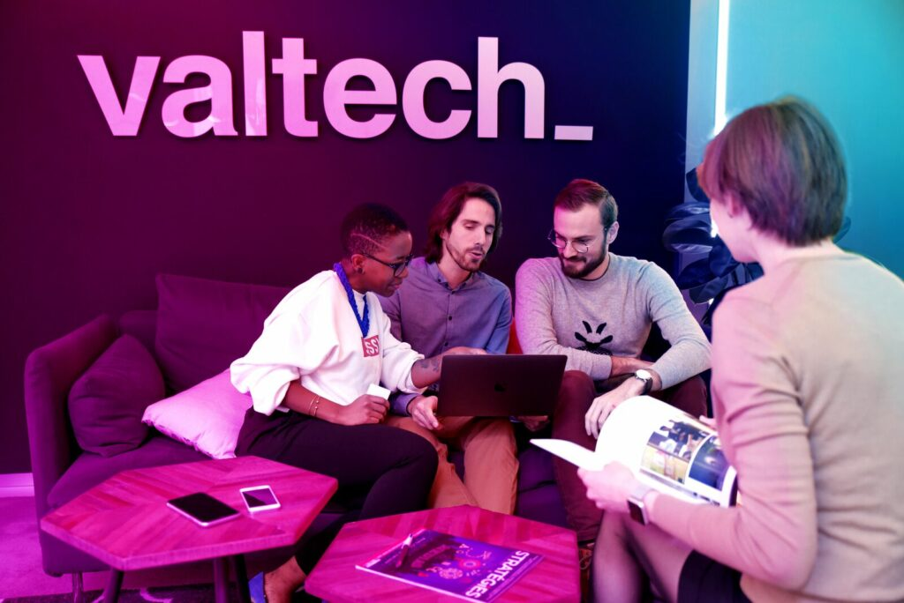

Välkommen på lunchföreläsning med Valtech!

Ansökan till Valtechs talangprogam har nu öppnat – kom på vår lunchföreläsning så berättar vi mera om vårt populära talangprogram och hur det är att jobba på Valtech. Per Gustafsson som är Linköpings alumn och Valtechare kommer att berätta om sin resa från talang till fullfjädrad Valtechkonsult.

Lunchföreläsningen äger rum via Teams onsdag den 13 oktober kl 12.15. Vi bjuder dom 60 första anmälda på en matkupong, så vänta inte med att anmäla dig.

Om du redan nu vet att Valtechs talangprogram är det självklara valet för dig, tveka inte - skicka in din ansökan direkt, vi har ett begränsat antal platser och intervjuar löpande. Du kan läsa mera och skicka in din ansökan [här](https://www.valtech.com/sv-se/karriar/lediga-tjanster/talangprogrammet-tech-987564/).

Vi hörs!

Hälsningar,

#### Vännerna på Valtech

Anmälan hittar du [här](https://forms.gle/qebP775WeV4AEScP8)  
En matkupong, 100 kr på wolt.com skickas ut efter deltagande på föreläsningen.  
Länk till föreläsningen på Teams kommer senare.
