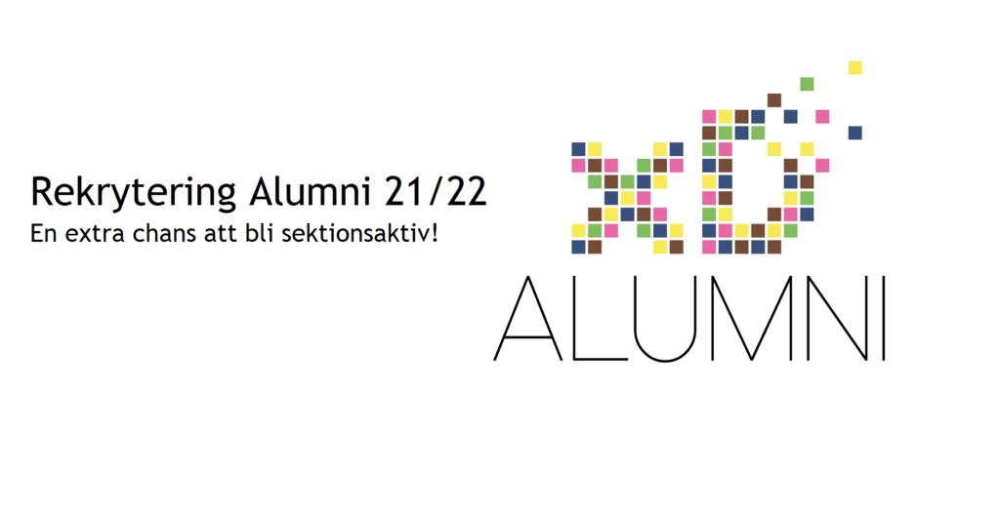

Taggad på att vara sektionsaktiv? Då är detta din extra chans att bli det! Som sektionsaktiv får du gå på sektionsaktivas midoff och fuckoff. Något du inte vill missa! Som medlem i Alumni får du också chansen att gå på framtida Generationssittningar! Alumniutskottet, a.k.a Alumni, finns till för att främja kontakten mellan D-sektionens studenter och de som avslutat sin utbildning på något av D-sektionens program, alumner.

Detta genom att hålla i olika typer av evenemang som alumner är delaktiga i, såsom lunchföreläsningar eller Afterwork. Men också genom att intervjua alumner och lägga upp dessa intervjuer på sektionshemsidans alumni-blogg och med skugga alumn möjligheter, där studenter får chansen att följa med under en alumns arbetsdag. Alumni håller även i Generationssittningen, en sittning för alla tidigare och nuvarande förtroendevalda.

Låter något av detta intressant och du känner dig taggad på att själv träffa och hjälpa andra D:are träffa alumner, se till och sök! Det krävs inga förkunskaper, det ända som krävs är att du är taggad på Alumni och är villig att lära dig något nytt!Ansökan stänger 14/11 23:59 och intervjuer sker löpande, så vänta inte med att söka!

Ansökningsformulär: [https://forms.gle/43QcVMxSjVbkuZ6M8](https://forms.gle/43QcVMxSjVbkuZ6M8)
