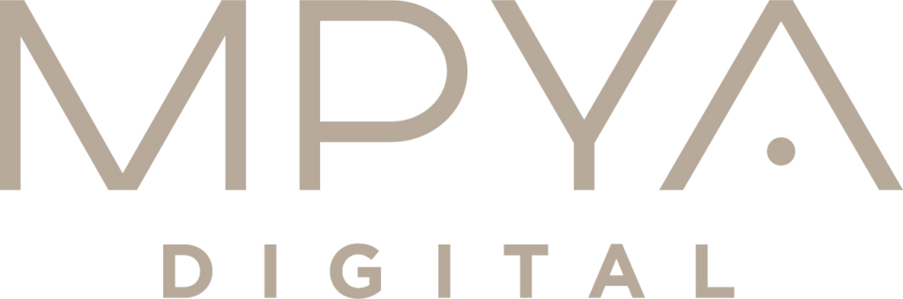
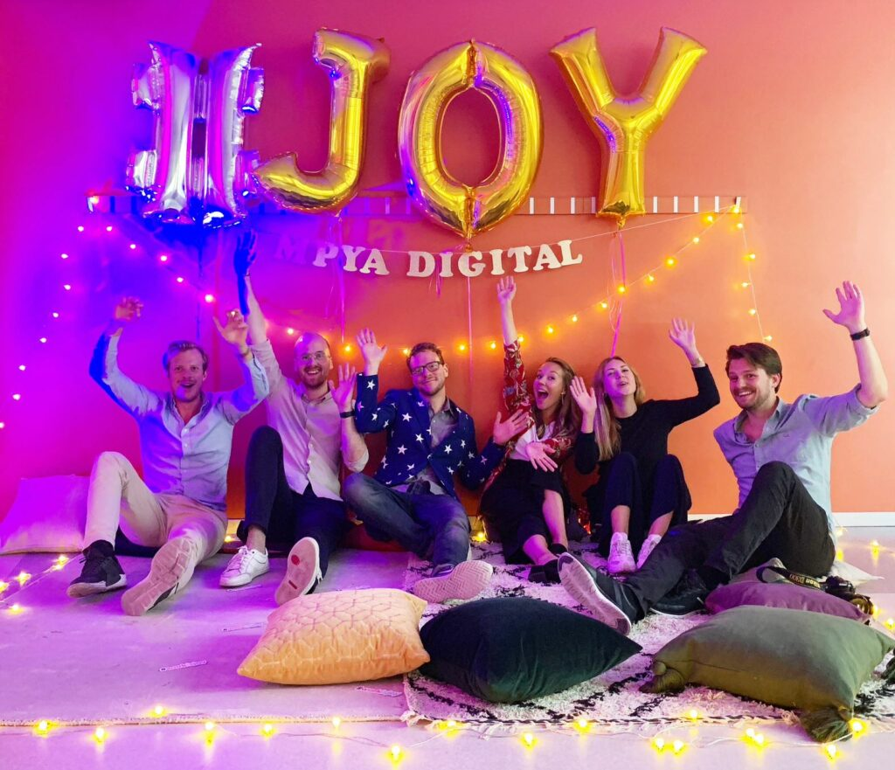

Read more about us at: [https://mpyadigital.com/](https://mpyadigital.com/)  
Are you curious about what is going on in our minds? Read our articles here: [https://mpyadigital.medium.com/](https://mpyadigital.medium.com/) or [https://mpyadigital.com/articles/](https://mpyadigital.com/articles/)  
Want to see updates about what is happening at Mpya more daily? Follow us on [https://www.linkedin.com/company/mpya-digital](https://www.linkedin.com/company/mpya-digital)

Wednesday the 24th of November, from 17.30 @ HG.

What can you expect?  
We’ll have an evening with good food, refreshing beverages, and a fun activites All from board games, beerpong, to get the opportunity to talk to a consultant regarding all from tech to life as an consultant. A enJOYable night to sum it all. Come as you are – and come hungry!

Who are Mpya Digital?  
Mpya Digital is an IT consulting company that started in January 2018. We believe that our job should be fun, challenging and developing, which we summarize as Work is joy! Today, the company consists of three core functions, consultants, sales and recruitment and we have grown to 54 good hearted colleagues!

As consultants, we of course focus on good delivery in web and software development for our customers in more or less all industries, ie we work with all types of tech related companies. We also want to contribute with a holistic perspective, how we act as role models for each other and the importance of authenticity.

We have a culture with a focus on activities, educations and climate that contributes to becoming confident consultants and can thus perform at a high level.  
We love to spend time together and do fun things. For example we play boardgames, solves problems, and more!

Looking forward to meet you there!

Register, before 14/11, [here](https://forms.gle/o78z2AGAyqBiF8Dz6).

