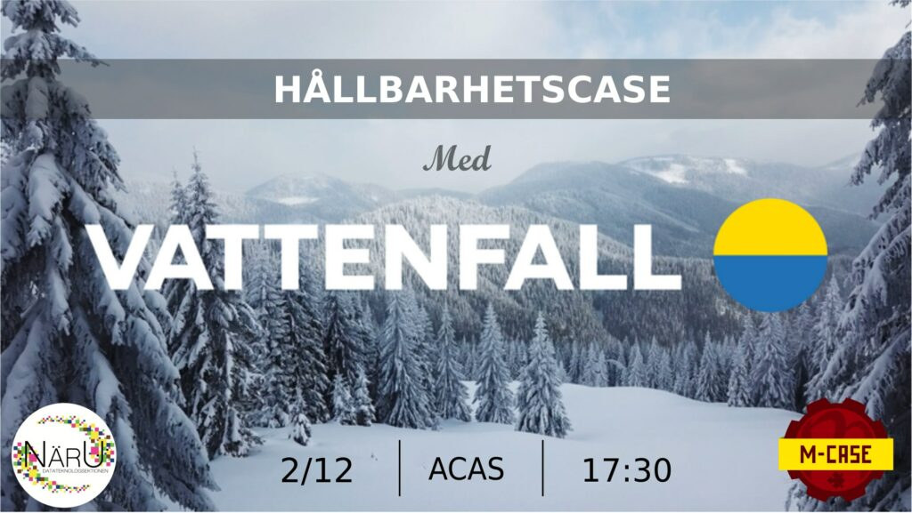

Välkomna till casekväll med Vattenfall, M-Case och NärU!

Vattenfall är ett europeiskt energiföretag med cirka 20 000 anställda. I mer än 100 år har vi elektrifierat industrier, levererat energi till människors hem och moderniserat vårt sätt att leva genom innovation och samarbete. Vi vill nu göra det möjligt att leva fossilfritt inom en generation. 

På den 2a december kommer vi ha en casekväll och mingel till både studenter från data- och maskinsektionen med fokus till hållbarhet. Kom och lär dig mer om Vattenfall, vad vi jobbar med och vad vi kan erbjuda till studenter och nyligen examinerade. Under kvällen kommer 4 Vattenfalls medarbetare presentera mer om vårt arbete samt en casefråga som deltagare får svara till. Kvällen slutar med mingel, lättsamma tävlingar mellan sektionera och annonsering av den vinnande laget. Är du färdig att ta emot utmaningen och testa i praktiken vilken typ av frågor anställda på Vattenfall jobbar med?

NÄR? 2/ 12 klockan 17:30

VAR? ACAS-salen i A-huset

Anmälan för D:are görs via [detta](https://forms.gle/CyppZ4c5M8W9FfDQA) formulär. Anmälan stänger redan 28/11.

Eventet finns även på [Facebook](https://fb.me/e/1nwYa12fG), kika in där också!
