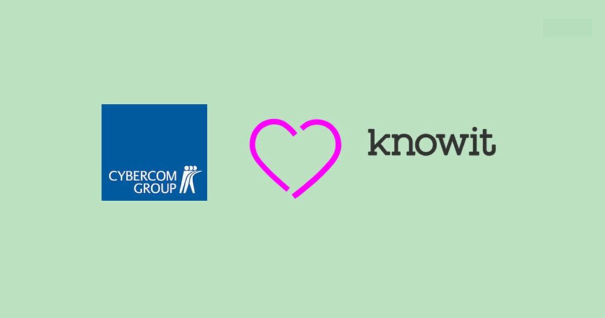

Nu har vi på Cybercom gått ihop med Knowit. Vi kallas numera Knowit Connectivity och jobbar med R&D uppdrag och algoritmutveckling.

Vi jobbar främst i team med ett agilt arbetssätt för att lösa våra kunders utmaningar. Vi söker nu flera olika positioner, bland annat juniora utvecklare och exjobbare, så passa på att höra av dig till oss!

I Linköping finns 4 Knowit bolag, Knowit Experience, Knowit Insight, Knowit Solutions och Knowit Connectivity, med c:a 130 medarbetare tillsammans (3800 i Norden). Som bolag strävar vi efter att vara en helhetsleverantör till våra kunder och vi står för att vara schyssta, nära och innovativa.

Tycker du programmering är kul – hör av dig innan jul!

Länk till exjobbsannons: [Exjobba på Knowit Connectivity i Linköping](https://www.knowit.se/jobb/exjobba-pa-knowit-connectivity-i-linkoping/)  
Länk till junior C++ annons: [Junior C++ utvecklare som söker nya utmaningar!](https://www.knowit.se/jobb/junior-c-utvecklare-som-soker-nya-utmaningar/)
