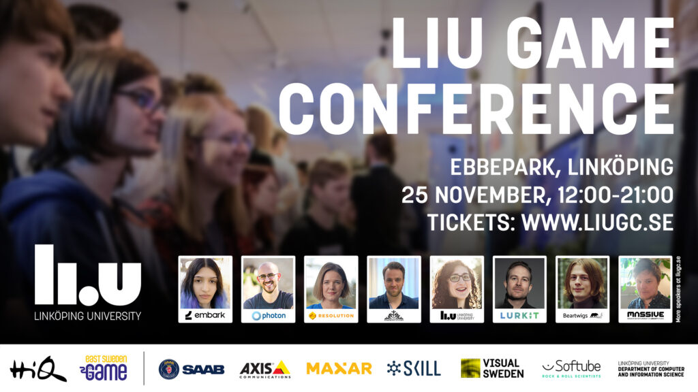

LiU Game Conference är en årlig konferens om dataspel och digitala upplevelser - presenterad av Linköpings universitet i samarbete med East Sweden Game! [www.liugc.se](http://www.liugc.se/)

<!--more-->

Konferensen är torsdagen den 25 november kl 12:00-21:00 i Ebbepark, Linköping. Vi erbjuder föreläsningar med tunga spelbolag, forskning, mingel, temarum, spelutställning och en företagsmässa med lokala bolag som rekryterar.  Konferensen innehåller också LiU Game Awards, där studenter från Linköpings universitet tävlar med innovativa spelprototyper.

Mer info och biljetter: [www.liugc.se](http://www.liugc.se/) 

Några av föreläsarna:

- **Embark Studios**: En av Sveriges mest intressanta spelstudios. Embark berättar hur de använder AI och matematiska funktioner för att driva animation och spelkänsla i deras kommande spel.
- **Resolution Games**: Ett av världens största VR-spelföretag berättar om hur algoritmer och omedvetna beslut påverkar design av spel, och hur vi kan motverka det. 
- **Massive Entertainment**: Studion bakom spel som The Division 2, Avatar: Frontiers of Pandora och ett nytt Star Wars spel föreläser om hur man lyckas med animation i spel. 
- **Photon**: Utvecklar teknik för multiplayer i spel med över 500 miljoner aktiva spelare varje månad. De föreläser om hur man kommer igång med multiplayer i sitt spel.
- Två forskare från **Linköpings universitet** pratar om gamification och visualisering av Science Centers med spelteknik. 
- Två spelstudios från **East Sweden Game** pratar om marknadsföring av spel och hur man skapar en egen spelmotor. 

Mer info och biljetter: [www.liugc.se](http://www.liugc.se/)
