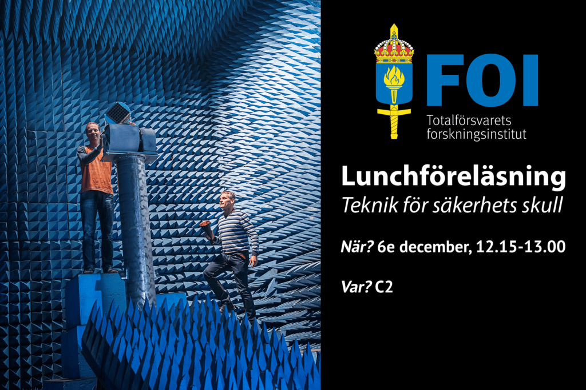

Teknik för säkerhets skull  
Totalförsvaret forskningsinstitut, FOI, kommer att bjuda på en teknikresa som sträcker sig från dåtid, vidare till nutid och ända in i framtiden.  
Du kommer få en liten inblick i nuvarande och kommande utmaningar som samhället står inför och vilka kan lösas med ny spännande teknik.  
För mer info om vad FOI arbetar med, kika på [denna](https://www.youtube.com/watch?v=62i9UU41MC4) video.

Var? C2  
När? 6/12 12.15-13.00  
Det kommer bjudas på wraps till anmälda.  
Anmälan stänger 3/12 23:59  
Formuläret hittar du [här](https://forms.gle/wNwZXsb4fr4gD1916).

Eventet hittar du även på [Facebook](https://fb.me/e/1BylBuKhS).
