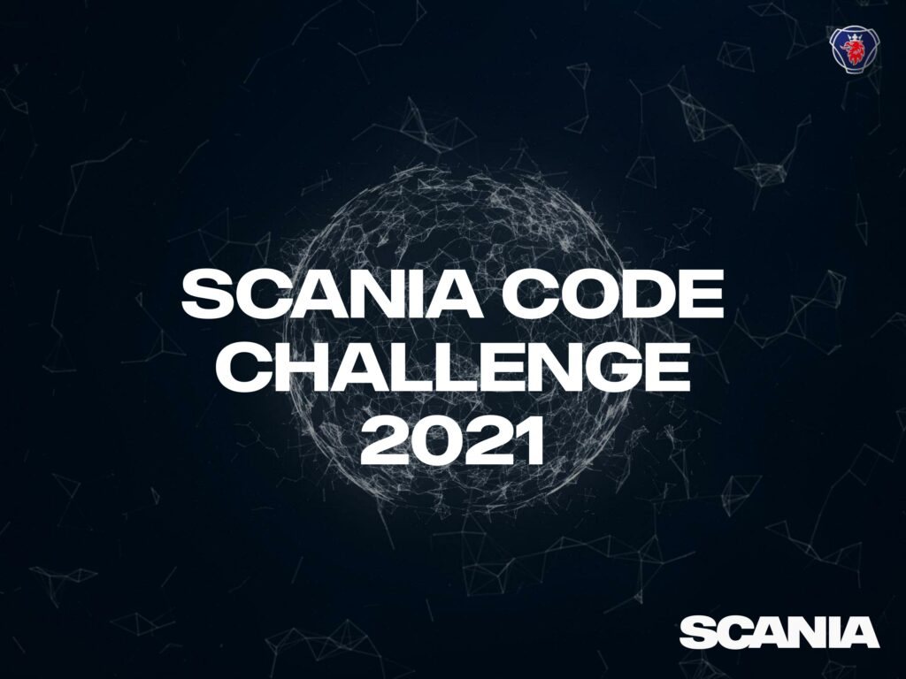

**_Scania Code Challenge!_**  

**_\- Are you a problem solver and want to Drive real change?_**  

_As Scania is moving towards a Data & software driven provider of sustainable transport solutions, we need skilled people to Drive this journey together with us!_  

_Take on the Challenge to try out your skills and get more insight in how you can create your journey with us._  

_You will be challenged by different problems, divided in several rounds during the fall. If you take part in this Challenge you will have the chance to collect\* nice prizes, get invited to a Play-Off with the opportunity to reach the FINAL at Scania Hack on the 9th of December._ 

_\- This will be a day to remember!_ 

_Are you ready? Get to the Challenge here:_ [_https://www.scania.com/group/en/home/career/life-at-scania/scania-hack/scania-code-challenge.html_](https://www.scania.com/group/en/home/career/life-at-scania/scania-hack/scania-code-challenge.html)

_\*to be able to claim prizes and get invited to final, you have to be located in Sweden_

  
_Next round starts at 12.00 on the 11th of November!_
