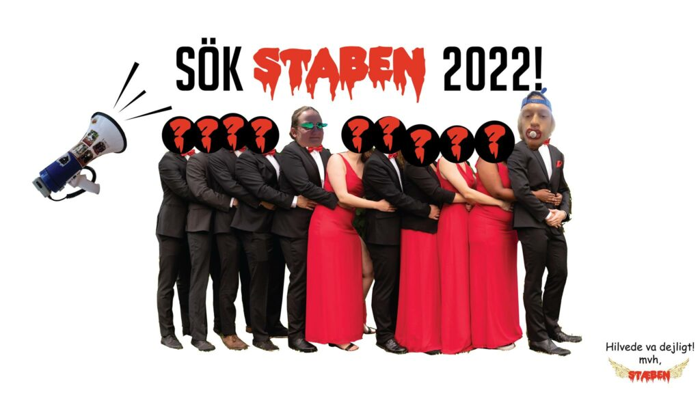

<figure>

<figcaption>

Nu är det dags! Som ni (och vi!) har väntat… STABEN 2022 ska bli fulltaliga!  
  
  
En tokfin söndag den 7/11 så kom Generalen och Kassören till på mystiska och inte alls normala vis. Nu söker vi efter resten av vårat gäng för att tillsammans bilda STABEN 2022!  
  
  
Kan du hålla minen när nollan drar sina bästa kattskämt? Är just du den nästa att utmana dina förmågor att prata med ljus röst och samtidigt se riktigt badass ut? Är du eller känner du den perfekta personen för att arra ett hejdundrande nolle-p? Då borde du söka eller nominera till STABEN 2022!  
  
  
För att ge en lite bredare bild av STABEN:s olika medlemmar/poster så kommer STABEN 21/22 under de närmaste dagarna att få presentera sig här i eventet. Även nya Generalen och Kassören kommer att få en chans att presentera sig, så håll utkik!  
  
  
Postbeskrivningar hittar du här, observera att posterna kan komma att ändras i samband med rekryteringen: [https://staben.info/postbeskrivningar.pdf](https://l.facebook.com/l.php?u=https%3A%2F%2Fstaben.info%2Fpostbeskrivningar.pdf%3Ffbclid%3DIwAR2InBZqCb6pveanNMwflyRoh7qTl3p7osi6ohbSXL2EBebtdkK9ngikX1E&h=AT3G9CJGgKgCMnGU_xR5R5XwbTgrV6ympbZRdE4P-qvaoeEC7OCq6fY4kDAaGrHQYFAPNG2oHgOGHqdA5sldMO-RUzC3UWalzuyyF6uWPDBl76Vpl9RPYVIrClc2GlPeyEpLFMOTtoMlNbgG7QQp&__tn__=q&c[0]=AT2ysYAzFtm7nXTZ858wGTY2QYQiVO0jbI6kVLeBlKG_00t2plaAsFPgskSE5s6RMpTFaUkyEIzcr8Ww6y5DXuT1fbfKeUPhVhVhbrLsRy17oHHPikJiWFwyyrR3c5ohXcFcMF4lOcbS7O8QrPZMmpapXeUctFdsdhI8DnT3y_rlQtrWaw)  
  
  
Ansökan och nominering hittar du här. Sista dagen att ansöka är den 1a december. [https://forms.gle/eXL3Dy9cdJBFxLBK7](https://l.facebook.com/l.php?u=https%3A%2F%2Fforms.gle%2FeXL3Dy9cdJBFxLBK7%3Ffbclid%3DIwAR1s1wXG1tRojTXpePysQneDsVOa-8HBk_DHlJVsIN1UzIP3dzaL7LH6f_M&h=AT13tvuqGgdkmDHfTMVUJYLE_xSlIA5TG72H-iGZrCaL5txLNw_Ju9Fr_ly2LvtuvTtKgdnKChV2IoSWwBa1oc7we9QJE0ZGAHdBwuboHnBJ7QZegB2mwbNTndqG0m5IOUMIZ7YV-sMYB16nq8HS&__tn__=q&c[0]=AT2ysYAzFtm7nXTZ858wGTY2QYQiVO0jbI6kVLeBlKG_00t2plaAsFPgskSE5s6RMpTFaUkyEIzcr8Ww6y5DXuT1fbfKeUPhVhVhbrLsRy17oHHPikJiWFwyyrR3c5ohXcFcMF4lOcbS7O8QrPZMmpapXeUctFdsdhI8DnT3y_rlQtrWaw)  
  
  
Om du har några frågor ryck tag i oss eller kontakta gärna:  
Casper Jensen: LillGeneral@staben.info  
Linnéa Ivansson: LillKassor@staben.info  
  
  
Om du har postspecifika frågor så kan du kontakta sittande STABEN:  
BarWerk: Filip Jakobsson, barwerk@staben.info  
BokningsWerk: Elise Lång, bokningswerk@staben.info  
Mat och Sittning: Helena Girmai, mat@staben.info  
Nollegrupp och Fadderkul: Robin Boregrim, nollegrupp@staben.info  
Spons: Simon Sandberg, spons@staben.info  
Karaktär: Jim Teräväinen, karaktar@staben.info  
Tryck och Biljett: Kimberley Andersson, tryck@staben.info  
Webb och Info: Isak Horvath, webb@staben.info  
Fadderansvarig: Matilda Engström Ericsson, fadderans@staben.info 

</figcaption>

</figure>
