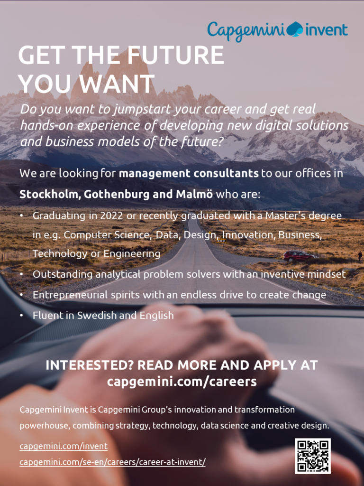

Are you our next management consultant and ideator? Passionate to answer and bring to life “what’s next?”, in the fourth industrial revolution where businesses need to rethink everything they know?

The pace of change is new in today’s world. To survive disruption, businesses need to invent and reinvent. It is about finding new sources of value creation. Capgemini Invent is the management consulting, innovation and transformation powerhouse of the Capgemini Group.

We are looking for ambitious students graduating during 2022 and young professionals with a Master’s degree in e.g. Computer Science, Technology, Engineering, Design, Innovation or Business. The position is located in one of our offices in Sweden; Stockholm/Kungsholmen, Gothenburg or Malmö. It is possible to join us during all quarters of 2022.

Read more and apply at: [https://www.capgemini.com/se-en/jobs/management-consultant-graduate-young-professional-stockholm-gothenburg-malmo/](https://www.capgemini.com/se-en/jobs/management-consultant-graduate-young-professional-stockholm-gothenburg-malmo/)

