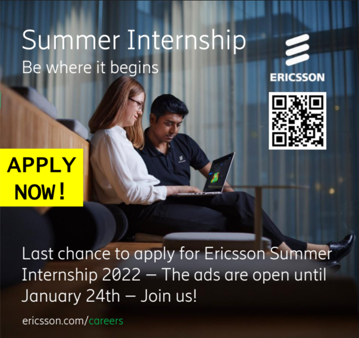

  
**Got any plans for summer vacation?**

We have one for you. How about taking a step towards your career by putting knowledge in to practice in a global company at the forefront of technology? Be the one who did and build your professional network!

**We’ll help you build your future…**

…by putting you on projects within areas such as 5G, software development, machine learning, cloud native, Artificial Intelligence, test development, verification, hardware development, embedded software and more. We are on the cutting-edge of technology, and we want you on board! Come work and learn with us, and build your solutions to our technology.

**You’ll help us build the world…**

…by applying knowledge from your field of study: Computer Science, Software Engineering, Engineering Physics, Electrical engineering, Information Technology, Machine Learning or similar. At Ericsson, there is always room for another passionate and creative programmer, mathematician, hardware enthusiast, cloud devotee or anyone who is as genuinely interested in technology as us!

Did we mention you will also get the chance to know us better? You´ll experience Ericsson at its finest, with fun activities and presentations given by our technical leaders and experts.

To read more and to apply – click this link:

[Ericsson Summer internship Sweden 2022](https://jobs.ericsson.com/search/?page=1&jobPipeline=careersite&utm_source=ericsson.com&utm_medium=referral&utm_campaign=search_widget&q=summer+internship&locationsearch=sweden&optionsFacetsDD_shifttype=)

Last date to apply is January 24th.
