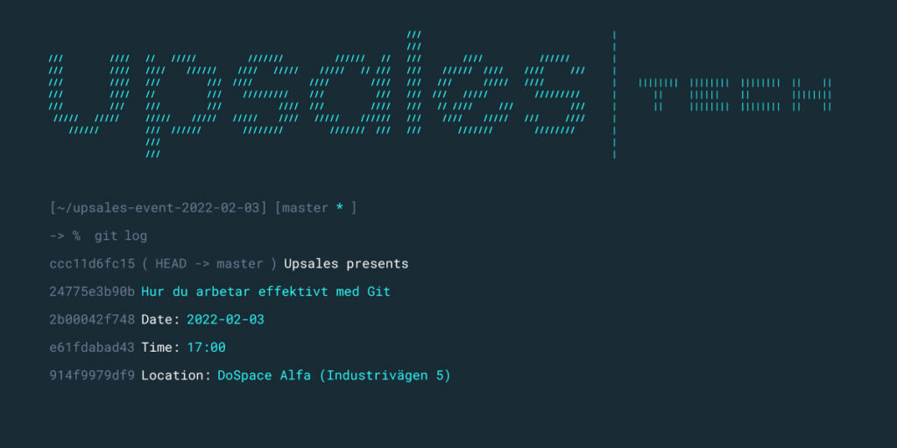

**Hur du arbetar effektivt med Git**

Som utvecklare har man många verktyg i verktygslådan. Ett av dem är ett versionshanteringssystem. 80% av företagen väljer Git som sitt verktyg och många utvecklare kämpar dagligen med vanliga problem som merge konflikter, borttappad kod, kod som av misstag hamnar på master-branchen etc.

Träffa Upsales på en AW med snacks och dryck där vi visar och berättar om några av Gits funktioner och hur de hjälper dig att bli en bättre och effektivare utvecklare utifrån våra erfarenheter.

OBS! på grund av Covid-19 kom enbart om du är symptomfri.  
  
  
Var? Industrigatan 5  
När? 3/2 17:00  
Anmäl dig här:  
[https://pages.upsales.com/15882u108026f75f7545318ac540054cbab899](https://pages.upsales.com/15882u108026f75f7545318ac540054cbab899)
