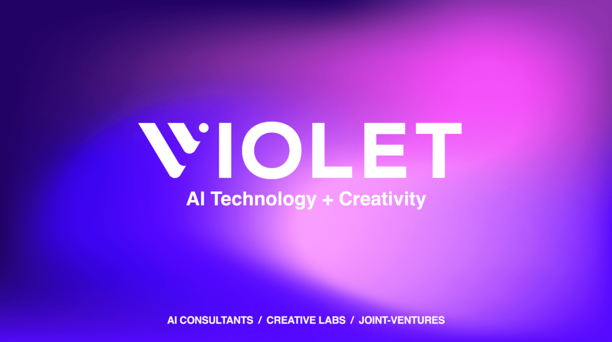

Violet AI Lab söker utvecklare inom maskininlärning!

Violet AI Lab är det stockholmsbaserade bolaget med AI och maskininlärning i fokus, där vi utvecklar både våra egna produkter och som konsulter. På Violet möts teknologi och kreativitet genom utvecklandet av AI-projekt i framkant. Vi hjälper våra kunder med att realisera maskininlärning hela vägen från rådgivning, idé, utveckling, och implementering. I vårt labb utvecklar vi även nästa generations bolag med maskininlärning i fokus. Hos Violet föder vi fram framtidens utvecklare som har djup kunskap inom alla delar av processen som behövs för att realisera maskininlärning i produktion. Vi som jobbar här är prestigelösa personer som gillar att lösa komplexa problem och genom att kombinera teknisk spetskompetens med kreativitet kan vi leverera de allra bästa lösningarna till våra kunder.

Vi söker just nu ett par juniora utvecklare som tar examen till sommaren och vill växa tillsammans med oss. Är du intresserad av att jobba med AI i framkant hos ett ungt och härligt företag? Tveka då inte att ansöka!

Ni kan läsa mer om tjänsten och ansöka direkt via LinkedIn [här](https://www.linkedin.com/jobs/view/2852311639), eller maila oss på jobs@violet.ai. Bifoga ditt CV tillsammans med några rader om dig själv samt dina kontaktuppgifter.

Läs mer om oss [här](http://www.violet.ai).

Vi ser mycket fram emot att få träffa dig!
