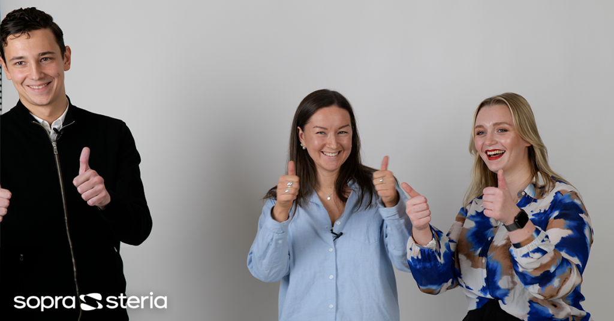

Sveriges bästa traineeprogram för civilingenjörer?

Åsa Billgren, civilingenjör från Linköpings universitet, numera inne på sitt tredje år som IT-konsult på Sopra Steria, ger sin bild av vad som kan förklara att Sveriges studenter rankat Sopra Sterias traineeprogram som det bästa i landet. Välkommen!

* * *

När? 30 mars, kl 12.15  
Var? C2  
Anmäl dig [här](https://forms.gle/3iTKnscAe5KVRS7y7).  
Kika gärna in eventet på [Facebook](https://fb.me/e/1yp9l5vBU)!
