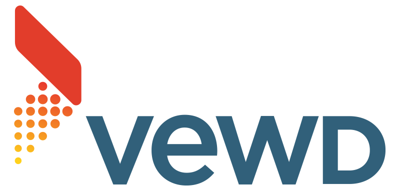

Vewd focuses on technology for Smart TVs and connected devices with the goal of bringing Over-The-Top content into peoples living rooms. With customers and partners like Sony, Verizon, Hisense, and TiVo we are market leading in enabling the transition to OTT.

We are a technology focused company with great individual freedom but also great individual expectations where everyone has a role in bringing out the best in our products!

In Linköping we are 25 people, working on everything from firmware integration, to web browser core development on top of Chromium, to UX frameworks on the web application level. Our latest challenge is to, together with our colleagues in (mainly) Poland and Taiwan, develop a fully featured modern Smart TV / STB platform and user interface written with cutting edge web technologies.

You can find available jobs [here](https://www.vewd.com/jobs/).

Want to know more about Vewd? Check out the [video](https://fb.watch/btNRYLaY5F/)

