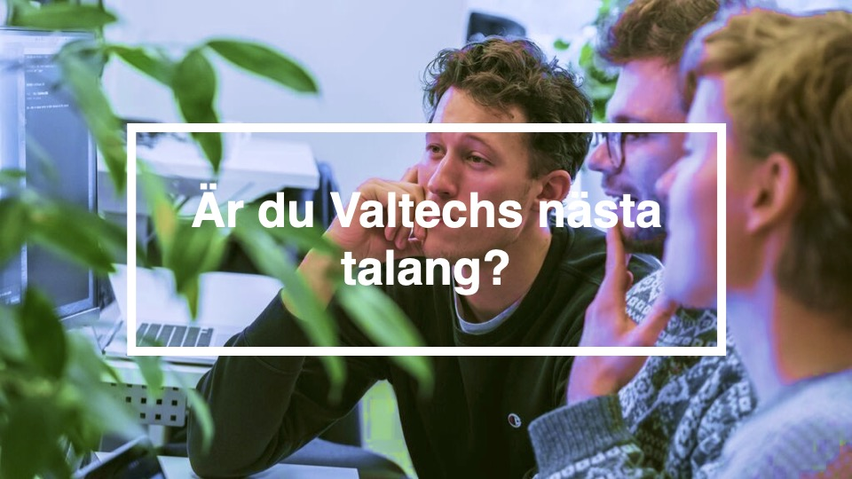

**Hej studenter, nu har vi på Valtech öppnat upp ansökan till våra populära talangprogram inom tech och ux!**

Valtechs talangprogram är en fantastisk möjlighet för dig som vill börja jobba med digitala lösningar och vill utveckla dina kunskaper i arbetslivet. När du blir antagen till talangprogrammet så blir du också anställd på Valtech och har lön från dag ett.

Genom talangprogrammet får du en gedigen utbildning som skapar en naturlig brygga mellan studier och arbetsliv. Om du väljer att gå **talangprogrammet tech** så kan du dessutom göra ditt **exjobb** hos oss. Vi kan hjälpa dig hitta intressanta områden, formulera frågeställningar och hjälpa till med handledning.

Talangprogrammet genomförs på våra kontor i Stockholm eller Göteborg och är 3 månader långt. Fokus ligger på utbildning och projektarbete (kundprojekt). Under utbildningen går du från labbuppgifter till kod som finns ”på riktigt”. Du hinner också gå igenom ett projekts alla faser innan det är dags att möta din första kund samtidigt som du är anställd och har full lön.

**Höstens program börjar den 5 september** och vi har ett begränsat antal platser. Vi intervjuar löpande så skicka in din ansökan redan idag så att du kniper din plats.

Är du intresserad av **talangprogrammet tech** kan du läsa mera och ansöka [här](https://www.valtech.com/career/jobs/talangprogrammet-tech-987564/).

Är du intresserad av att gå **talangprogrammet UX** kan du läsa mera och ansöka [här](https://www.valtech.com/career/jobs/talangprogrammet-ux-1379801/).

Vill du veta mer om hur det är att gå från Talang till konsult hos oss på Valtech innan du söker - läs om Martins resa [här](https://www.valtech.com/sv-se/blogg/fran-talang-till-konsult-martin/)!
