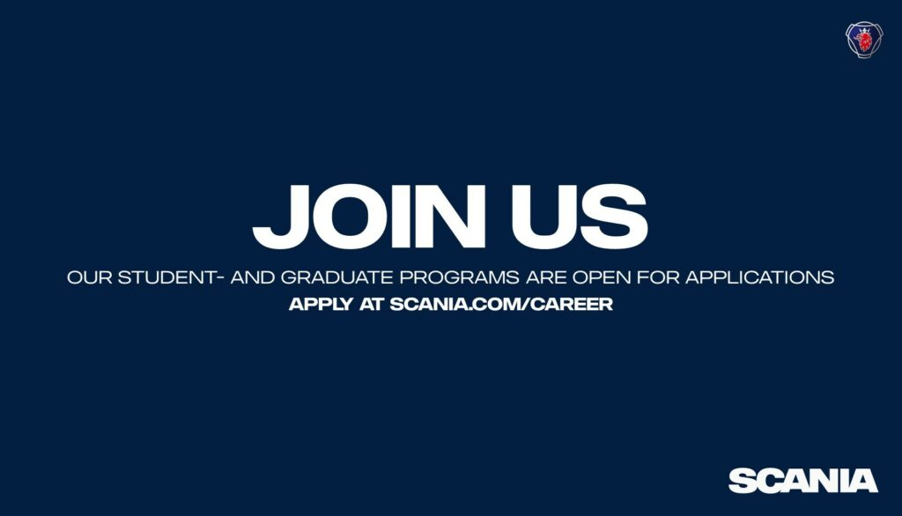

Soon to graduate and want to drive real change?

Our I-Talent Program is open for application.  
You are hired into a specific role where you will learn the job and develop skills to become an IT Professional. You will during the programs six months learn about Scania´s business and products through different go-and-see occasions and receive tailored technical training designed for you role. You will also within the I-Talent network develop soft skills at personal, group and Scania level.

We are looking for IT graduates who have the potential and desire to become expert IT Professionals at Scania. We expect you to have the ability and the drive to acquire knowledge both in an overall perspective and in certain areas in depth. Applicants should hold a relevant Bachelor, Master or equal degree with a maximum of 2 years work life experience.  
Written and spoken English is required. Skills in Swedish is needed in some of the teams, but is considered a merit in others.

\- Join us and utilize the power of software and data!

Read more and apply; [Scania I-Talent Program](https://www.scania.com/group/en/home/career/graduates/i-talent-program.html)

