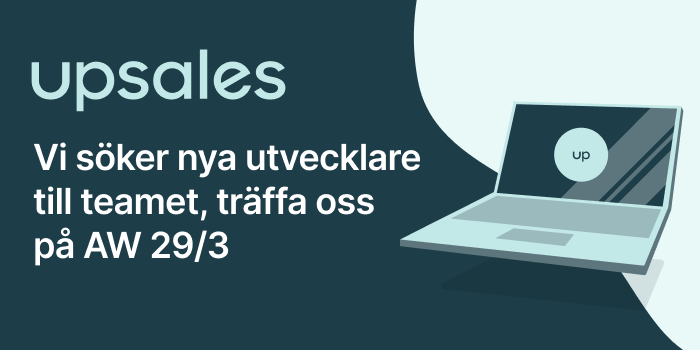

**Upsales söker utvecklare och bjuder in till AW den 29/3**

Upsales är det givna valet för snabbväxande bolag när de väljer CRM och som utvecklare hos oss får du möjlighet att göra skillnad för dessa kunder varje dag.

Vi söker dig som tycker det är kul att jobba med webbutveckling i de senaste teknikerna. Vi arbetar främst med Node.JS, Typescript och React. Hos oss får du möjlighet att jobba över hela stacken för att förverkliga våra idéer. Vi jobbar med snabba iterationer och det du har byggt idag kan finnas ute hos kunderna redan imorgon.

Upsales har kontor både i Linköping och Stockholm.

Läs mer om Upsales och tjänsten [här](https://emp.jobylon.com/jobs/48092-upsales-nordic-ab-junior-software-engineer/).

Tar du examen till hösten och tycker detta låter intressant så tycker vi att du ska komma förbi oss på AW den 29/3 där vi kommer bjuda på dryck, snacks och umgås - pingisbordet står redo för turnering.

Anmäl dig [här](https://pages.upsales.com/15882u661fc897222744af8922328a7805d0e5) - antalet platser är begränsat

**Adress:** Industrigatan 5, Linköping

**När:** 29/3 17:00 - framåt
