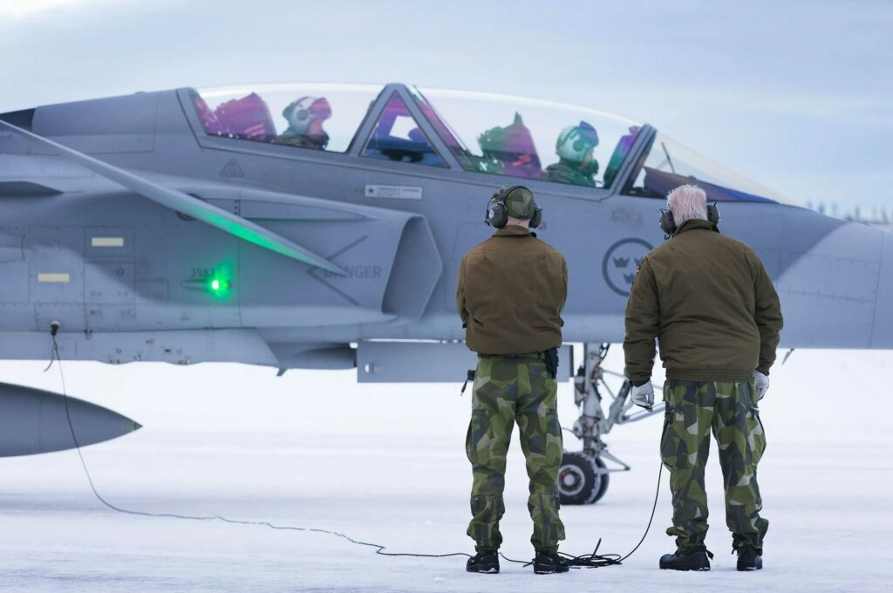

FMV upphandlar, utvecklar och levererar materiel och tjänster till det svenska försvaret. Vi söker efter en systemadministratör, som är i början av sin karriär, och som vill jobba med stödsystem som ingår i provning av stridsflygplan JAS 39 Gripen och andra system inom flygarenan. Har du viss erfarenhet av drift och underhåll av IT-system och vill lära dig mer? Då är detta jobbet för dig!

[Junior systemadministratör mot Gripen och helikoptrar (fmv.se)](https://www.fmv.se/jobb--karriar/lediga-jobb/junior-systemadministrator-mot-gripen-och-helikoptrar/)

