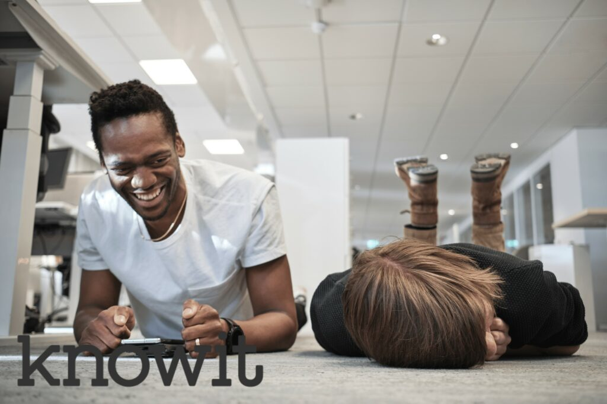

Varmt välkommen på kvällsevent tillsammans med Knowit!

Under kvällen kommer Knowit bjuda på mat och mingel på deras kontor i Mjärdevi. Häng med för chansen att snacka karriär med medarbetare på Knowit och testa dina kunskaper i kodutmaningen!

VAR? - Teknikringen 7, plan 4

NÄR? - 12/5 17:30

Om Knowit:

**Makers of a sustainable future**

Vi stöttar kunder i den digitala transformationen, förenklar människors vardag och skapar säkra och innovativa lösningar för en hållbar framtid.

—

Anmälan:

Sista anmälningsdag: 8/5 23:59

Anmälningsformulär: [https://forms.gle/NWPhQtY9NBx9ACCt5](https://forms.gle/NWPhQtY9NBx9ACCt5) 

–

Detta event använder sig av D-sektionens pricksystem, info hittar du här:  

[https://d-sektionen.se/wp-content/uploads/2022/02/Policy-for-avanmalan.pdf](https://d-sektionen.se/wp-content/uploads/2022/02/Policy-for-avanmalan.pdf)

Avanmälan görs till agnes.naru@d-sektionen.se senast 8/5 23:59
