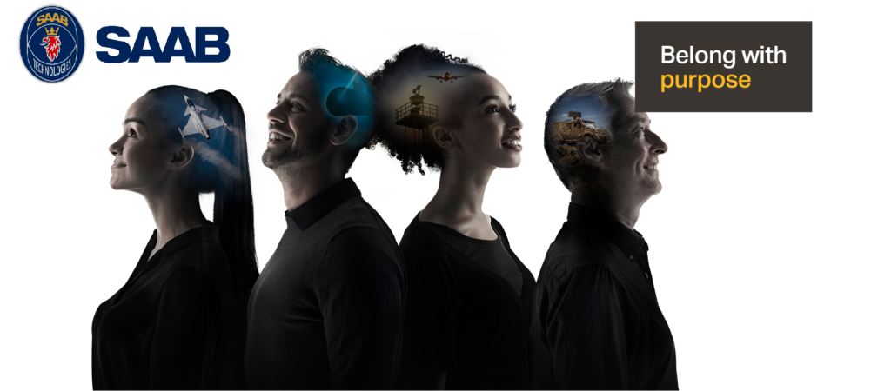

Hur är det att gå från att vara student på D-Sektionen till att jobba på ett företag som SAAB? Hur går det egentligen till att bygga ett flygplan? Varför är lunchrasterna mycket bättre på sommaren?

Detta och så mycket mer har ni chansen att få svar på när D-Alumnen Oskar Lind kommer och håller en lunchföreläsning!

Vill du veta mer? Besök [https://www.saab.com/sv/markets/sweden/jobba-med-oss](https://www.saab.com/sv/markets/sweden/jobba-med-oss) redan innan föreläsningen och läs på.

Maten som bjuds på är thai från Ming Express. Mättnadskänsla deluxe för den hungrige eller kanske räcker det även till middag?

—-- 

Datum: 21/4 

Plats: C3

Anmälan: [https://forms.gle/ipEq7Xp2p8NnHJkNA](https://forms.gle/ipEq7Xp2p8NnHJkNA)

Sista tid för anmälan: 17/4 23:59

Detta event använder sig av D-sektionens pricksystem, info hittar du här:  

[https://d-sektionen.se/wp-content/uploads/2022/02/Policy-for-avanmalan.pdf](https://d-sektionen.se/wp-content/uploads/2022/02/Policy-for-avanmalan.pdf)

Avanmälan görs till [sophie.naru@d-sektionen.se](mailto:sophie.naru@d-sektionen.se) senast 17/4 23:59
