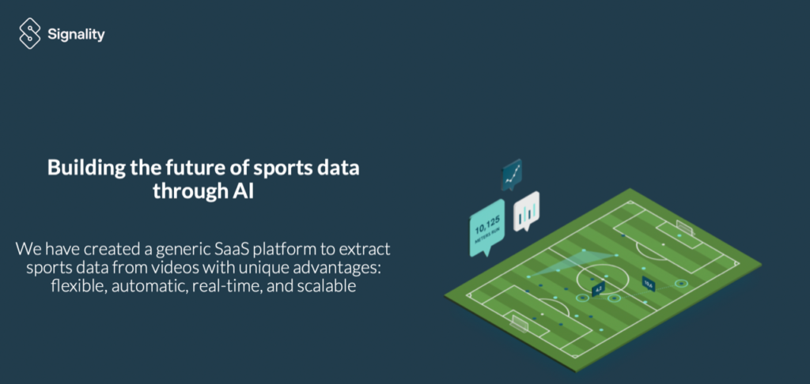

Hej alla D-are!

Den 19 maj bjuder Signality in till en intressant lunchföreläsning. De kommer att berätta mer om vilka de är och och vad dom håller på med samt hur de bygger framtiden inom sport-statistik och data med hjälp utav AI. Vill du också veta hur Signality arbetar för att kunna få en fullständig liveförståelse av en sport borde du följa länken nedan för att anmäla dig till lunchföreläsningen.

Det kommer att bjudas på mat i form utav sushi till de 50 första som anmäler sig.

Anmälan sker via följande länk:  
[https://forms.gle/TGwXt3UD87NzAap27](https://forms.gle/TGwXt3UD87NzAap27)

Sista anmälan är redan på måndag den 16/5, 23:59.

Detta är Signality:

Vi är Signality, ett innovativt företag som arbetar med deep tech och  
artificiell intelligens i framkanten av sport-tech.

Allting startade år 2016 när Mikael Rousson och Michael Höglund grundade Signality. Mikael som en komplett tech expert och före detta medarbetare på Apple, och Michael som en innovativ entreprenör, formade det perfekta teamet för att starta en fascinerande och framgångsrik resa. Motiverade av deras vision att göra sportdata till en självkörande bil har Signality genomgått en resa med inslag av både höga toppar och djupa dalar. Denna resa har nu förvandlats till ett ständigt växande och välnärt företag.

Vi löser framtidens sport genom att applicera AI och Computer Vision på olika  
sporter.

\_\_\_\_\_\_\_\_\_\_\_\_\_\_\_\_\_\_\_\_\_\_\_\_\_\_\_\_\_\_\_\_\_\_\_\_\_\_\_\_\_\_\_\_\_\_\_\_\_\_\_\_\_\_\_\_\_\_\_

Detta event använder sig av D-sektionens pricksystem, info hittar du här:  
[https://d-sektionen.se/.../2022/02/Policy-for-avanmalan.pdf](https://d-sektionen.se/.../2022/02/Policy-for-avanmalan.pdf?fbclid=IwAR0njC307EEt6O4ezDdeV3Ai9wweMhVOVu0F4SX7GSnXt1JkLRkKY0FYuZE)  
Avanmälan görs till gabriel.naru@d-sektionen.se senast 16/5 23:59

Återigen, sista anmälan: mån 16/5 2022, 23:59
