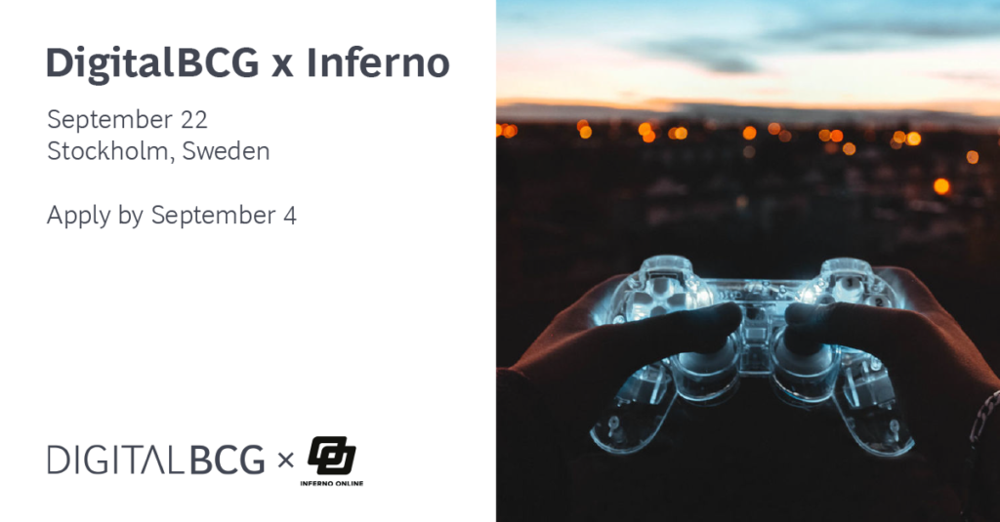

Are you passionate about gaming and interested in hearing more about management consulting with a digital twist?

We would like to invite you to our event in collaboration with Inferno Online, the world's largest gaming center, to learn more about DigitalBCG, get to know our consultants, and join a fun gaming competition!

On September 22, we will kick off the event at 17.00 at Inferno’s gaming center in central Stockholm. The evening will be filled with learning, mingling, and gaming. We invite digital and tech students and professionals, from gaming beginners up to experts!

Because the seats are limited, please apply by September 4 via [this link](https://careers.bcg.com/event/62f3df85dfd7a97b4cbe6858/DigitalBCG-x-Inferno-Gaming-Event?linkId=176825322)!

We look forward to meeting you and hope you are as excited as we are!
