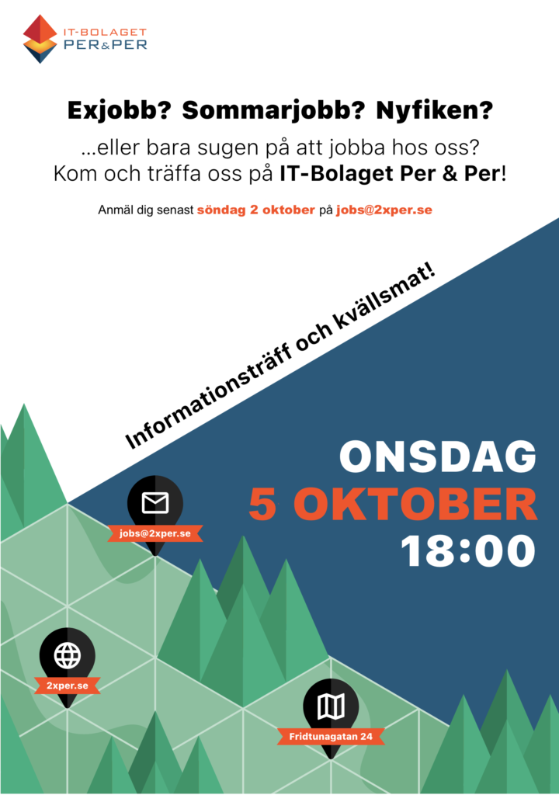

IT-Bolaget Per & Per utvecklar skogsverktyg i världsklass. Mobila IT-lösningar som bidrar till att göra det kul att jobba i skogsbranschen. Att arbetet går snabbt och att det blir lättare att göra rätt, är minst lika viktigt.  

Under de senaste 10 åren har vi jobbat i frontlinjen med att introducera nya sätt att arbeta med smarta mobiler, läsplattor och drönare i det dagliga arbetet. Bland våra kunder finns flera av de största skogsorganisationerna i Sverige och Norge.   

De största utmaningarna ligger fortfarande framför oss med att ta fram nya funktioner för effektivare team work, smart användning av fjärranalysdata, automatiska analyser och beslutsstöd.

