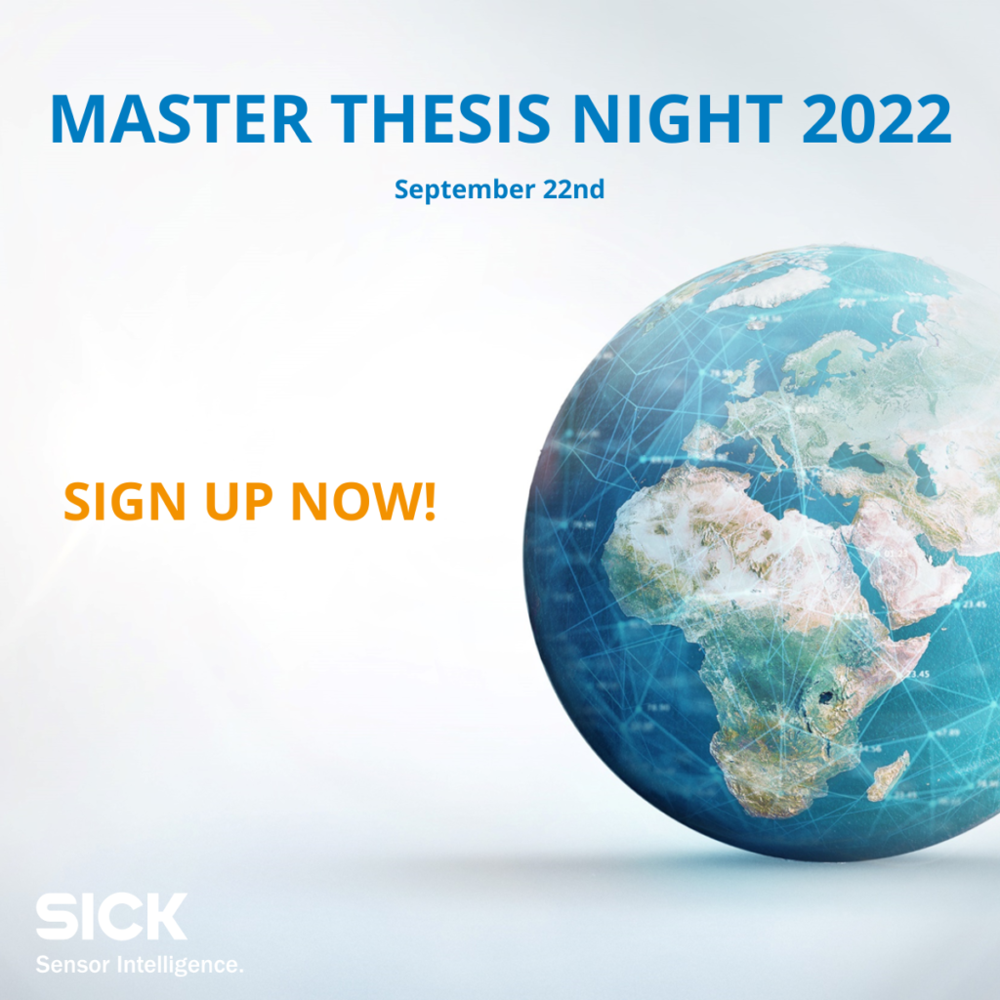
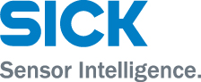

- Are you a master's student planning to write your Master's Thesis in the beginning of 2023? 
- Do you have an interest in software development, camera technology, image processing, machine vision or machine learning? 

Then you should come to our Master's Thesis night on September 22nd! Join us for a nice evening with some food and drinks and let us tell you more about us and our Master Thesis opportunities.  

[Sign up here!](https://career.sicklinkoping.se/jobs/212850-master-thesis-night-2022)

<!--more-->

_SICK is a world-leading supplier of sensors and sensor solutions for industrial applications. We are_ 

_11 000 employees in 50 countries and our headquarter is located in Freiburg, Germany. SICK in Linköping is an innovation center for Machine Vision and we are 85 committed employees with a big interest in image processing and visualization. For more than 35 years, our team at SICK Linköping has successfully developed and delivered software for technically leading products within the field of 2D and 3D vision, as well as system solutions for i.e. robot guidance and quality control._

_At SICK in Linköping, we are very proud of being a healthy and attractive workplace. For many years, we have been elected as one of the best workplaces in Sweden according to the survey Great Place to Work, the latest award is from 2021. We work actively to reduce our climate footprint and we are active in various ways to contribute to the society and to increase diversity at our workplace._

